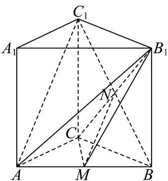

> [!faq]- 《专题19 空间直线、平面的垂直-线面垂直（高效培优期中专项训练）数学人教A版高一必修第二册》官方解析
>
> > [!success]- **【答案】** (1)证明见解析 (2) $\frac{3\sqrt{22}}{11}$
>
> > [!note]- **【解析】**
> > （1）在直三棱柱 $ABC-A_{1}B_{1}C_{1}$ 中，连接 $BC_{1}$ ，交 $B_{1}C$ 于点 N，连接 MN，如图：
> >
> > 
> >
> > 则 N 为 $BC_{1}$ 的中点，而 M 为 AB 的中点，则 $AC_{1} // MN$ ，又 $AC_{1} \not\subset$ 平面 $B_{1}CM$ ， $MN \subset$ 平面 $B_{1}CM$ ，所以 $AC_{1} //$ 平面 $B_{1}CM$ 。
> >
> > (2) 连接 $AB_{1}$ ，由 CA = CB = 2，得 $CM \perp AB$ ，又 $AA_{1} \perp$ 平面 ABC， $CM \subset$ 平面 ABC
> >
> > 则 $AA_{1} \perp CM$ ，又 $AB \cap AA_{1} = A, AB, AA_{1} \subset$ 平面 $ABB_{1}A_{1}$ ，因此 $\mathrm{CM} \perp$ 平面 $ABB_{1}A_{1}$
> >
> > 又 $MB_{1} \subset$ 平面 $ABB_{1}A_{1}$ ，则 $AM \perp MB_{1}$ ，又 $CA^{2} + CB^{2} = AB^{2}$ ，则VABC是等腰直角三角形，
> >
> > $CM = \frac{1}{2} AB = \sqrt{2}$ ， $MB_{1} = \sqrt{MB^{2} + BB_{1}^{2}} = \sqrt{11}$ ， $S_{\triangle CMB_1} = \frac{1}{2} CM\cdot MB_1 = \frac{\sqrt{22}}{2}$
> >
> > $S_{\triangle ACM}=\frac{1}{2}S_{\triangle ACB}=\frac{1}{2}\times\frac{1}{2}CA\cdot CB=1$ ，设点A到平面 $B_{1}CM$ 的距离为d，
> >
> > 由 $V_{A - B_1CM} = V_{B_1 - ACM}$ ，得 $\frac{1}{3} S_{\triangle B_1CM}\cdot d = \frac{1}{3} S_{\triangle ACM}\cdot AA_1$ ，解得 $d = \frac{3\sqrt{22}}{11}$
> >
> > 由 $AC_{1} / /$ 平面 $B_{1}CM$ ，得直线 $AC_{1}$ 到平面 $B_{1}CM$ 的距离即为点 $A$ 到平面 $B_{1}CM$ 的距离，
> >
> > 所以直线 $AC_{1}$ 到平面 $B_{1}CM$ 的距离为 $\frac{3\sqrt{22}}{11}$
