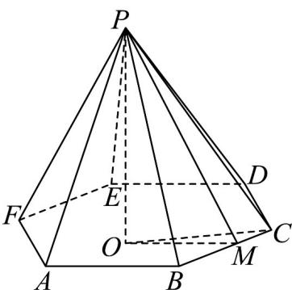
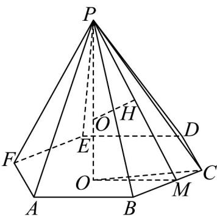
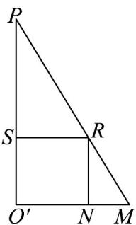
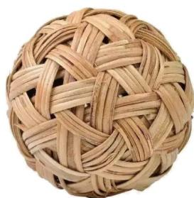
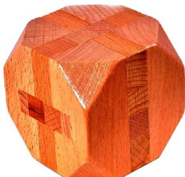
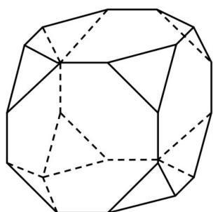
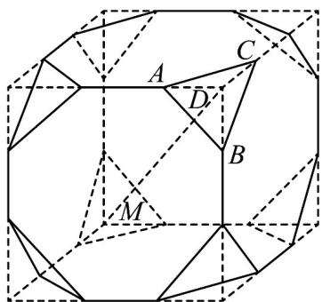
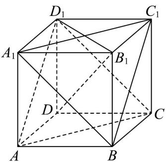

> [!faq]- 《专题19 空间直线、平面的垂直-线面垂直（高效培优期中专项训练）数学人教A版高一必修第二册》官方解析
>
> > [!success]- **【答案】** (1)3, $2\sqrt{3}$ (2)3 (3) $2\left(3-\sqrt{3}\right)\pi$
>
> > [!note]- **【解析】**
> > （1）作出棱锥的高 $PO^{\prime}$ ，因为是正六棱锥，所以 $O^{\prime}$ 是底面的中心，连接 $O^{\prime}C$ ，可知 $O^{\prime}C = 2$
> >
> > 
> >
> > 在 Rt△ $PO^{\prime}C$ 中，可知 $PO^{\prime}=\sqrt{PC^{2}-O^{\prime}C^{2}}=3$
> >
> > 设 $BC$ 中点为 $M$ ，由 $\triangle PBC$ 是等腰三角形可知， $PM \perp BC$ ，因此， $PM$ 是斜高，从而 $PM = \sqrt{PC^2 - MC^2} = 2\sqrt{3}$
> >
> > (2) 因为 $DE \parallel$ 平面 $PAB$ ，所以点 $D$ 到平面的距离 $d$ 就是直线 $DE$ 到平面 $PAB$ 的距离。
> >
> > 由 $V_{D-PAB}=V_{P-ABD}$ 得 $\frac{1}{3}\times S_{\triangle PAB}\times d=\frac{1}{3}\times S_{\triangle ABD}\times PO'$
> >
> > 又因为 $S_{\triangle PAB} = \frac{1}{2}\times 2\times 2\sqrt{3} = 2\sqrt{3},S_{\triangle ABD} = \frac{1}{2}\times 2\times 2\sqrt{3} = 2\sqrt{3}$
> >
> > 所以 $d = PO' = 3$
> >
> > (3) 设锥 $P - ABCDEF$ 的内切球与侧面 $PBC$ 相切于 $H$ ，可得 $H$ 在 $PM$ 上，连接 $OH$ 。在 $\mathrm{Rt}\triangle PO'M$ 中， $PO' = 3, O'M = \sqrt{3}$ 则 $PM = 2\sqrt{3}$ ，所以 $\angle O'PH = \frac{\pi}{6}$ 。
> >
> > 设内切球的半径为 $r$ ，由 $PO = 2OH$ ，可得 $3 - r = 2r$ ，解得 $r = 1$ 。故所求几何体是底面半径为 $^{1}$ 的圆柱。
> >
> > 
> >
> > 在 $\triangle PO'M$ 中，在 $O'M$ 上取点 $N$ ，使得 $O'N = 1$ ，过 $N$ 作 $NR \perp O'M$ ，交 $PM$ 于点 $R$ ，作 $RS\| O'M$ ，交 $O'P$ 于 $S$ ，则：
> >
> > $\frac{RN}{O'P} = \frac{MN}{MO'}$ ，故 $RN = 3 - \sqrt{3}$
> >
> > 所以该几何体的侧面积为： $2(3 - \sqrt{3})\pi$
> >
> > 
> >
> > ## 考点 07 求面面距离
> >
> > 31．蹴鞠（如图所示），又名蹴球，蹴圆，筑球，踢圆等，蹴有用脚蹴、踢、踢的含义，鞠最早系外包皮革、内实米糠的球因而蹴鞠就是指古人以脚蹴、踢、踢皮球的活动，类似于今日的足球．2006年5月20日，蹴鞠作为非物质文化遗产经国务院批准已列入第一批国家非物质文化遗产名录．已知某鞠（球）的表面上有四个点A，B，C，P， $BC=2\sqrt{3}$ ， $\angle CAB=60^{\circ}$ ， $PA\perp$ 面ABC， $PA=2\sqrt{5}$ ，则该鞠（球）的表面积为（）
> >
> > 【答案】
> >
> > 
> >
> > A. $9\pi$ B. $18\pi$ C. $36\pi$ D. $64\pi$
> >
> > 【答案】C
> >
> > 【详解】在 VABC 中， $BC = 2\sqrt{3}, \angle CAB = 60^{\circ}$ ，则 VABC 外接圆半径 $r = \frac{BC}{2\sin60^{\circ}} = 2$ ，
> > 球心在线段 PA 的中垂面上，由 $PA \perp$ 平面 ABC， $PA = 2\sqrt{5}$ ，得 PA 的中垂面平行于平面 ABC，
> > 因此球心到平面 ABC 的距离 $d=\frac{1}{2}PA=\sqrt{5}$ ，球半径 $R=\sqrt{r^{2}+d^{2}}=3$ ，
> > 所以该鞠（球）的表面积为 $4\pi R^{2}=36\pi$ .
> >
> > 故选：C
> >
> > 32. 鲁班锁（也称孔明锁、难人木、六子联方）起源于古代中国建筑的榫卯结构·如图 $^{1}$ ，这是一种常见的鲁班锁玩具，图 $^{2}$ 是该鲁班锁玩具的直观图，每条棱的长均为 $^{2}$ ，则该鲁班锁的两个相对三角形面间的距离为（）
> >
> > 【答案】
> >
> > 
> > 图1
> >
> > 
> > 图2
> >
> > A. $2\sqrt{3} + \sqrt{6}$ B. $\sqrt{3} + \frac{2}{3}\sqrt{6}$ C. $2\sqrt{3} + \frac{4}{3}\sqrt{6}$ D. $2\sqrt{3} + \frac{3}{4}\sqrt{6}$
> >
> > 【答案】C
> >
> > 【详解】由题图可知，该鲁班锁玩具可以看成是一个正方体截去了 $^{8}$ 个正三棱锥所余下来的几何体，如图所示，由题意可知： $AD = BD, AB = 2, \angle ADB = \frac{\pi}{2}$ ，所以 $AD = 2\sin \frac{\pi}{4} = \sqrt{2}$ .
> >
> > 故该正方体的棱长为 $2 + 2\sqrt{2}$ ，且被截去的正三棱锥的底面边长为 $2$ ，侧棱长为 $\sqrt{2}$
> >
> > 则该小三棱锥几何体的体积为 $V = \frac{1}{3} \times \left(\frac{1}{2} \times \sqrt{2} \times \sqrt{2}\right) \times \sqrt{2}$
> >
> > 
> >
> > 所以该三棱锥的顶点 $D$ 到面 $ABC$ 的距离 $h = \frac{V}{\frac{1}{3} \times \left( \frac{\sqrt{3}}{4} \times 2 \times 2 \right)} = \frac{\sqrt{6}}{3}$ .
> >
> > 易知鲁班锁两个相对的三角形面平行，且正方体的体对角线 $^{MD}$ 垂直于该两面，故该两面的距离 $d=\left(2+2\sqrt{2}\right)\times\sqrt{3}-\frac{2}{3}\sqrt{6}=2\sqrt{3}+\frac{4}{3}\sqrt{6}$ .
> >
> > 故选：C
> >
> > 33. 正方体 $ABCD - A_{1}B_{1}C_{1}D_{1}$ 的棱长为 $2\sqrt{3}$ ，则平面 $A_{1}BC_{1}$ 到平面 $AD_{1}C$ 的距离为（ ）A. 1 B. 2 C. 3 D. 4
> >
> > 【答案】B
> >
> > 【详解】连接 $B_{1}D, B_{1}D_{1}$ ，正方体中， $DD_{1} \perp$ 平面 $A_{1}B_{1}C_{1}D_{1}$ ， $A_{1}C_{1} \subset$ 平面 $A_{1}B_{1}C_{1}D_{1}$ ，则 $DD_{1} \perp A_{1}C_{1}$ ，正方形 $A_{1}B_{1}C_{1}D_{1}$ 中，有 $B_{1}D_{1} \perp A_{1}C_{1}$ ， $DD_{1}, B_{1}D_{1} \subset$ 平面 $DD_{1}B_{1}$ ， $DD_{1} \cap B_{1}D_{1} = D_{1}$ ，所以 $A_{1}C_{1} \perp$ 平面 $DD_{1}B_{1}$ ， $B_{1}D \subset$ 平面 $DD_{1}B_{1}$ ，则有 $A_{1}C_{1} \perp B_{1}D$ ，同理有 $A_{1}B \perp B_{1}D$ ， $A_{1}C_{1}, A_{1}B \subset$ 平面 $A_{1}BC_{1}$ ， $A_{1}C_{1} \cap A_{1}B = A_{1}$ ，所以 $B_{1}D \perp$ 平面 $A_{1}BC_{1}$ ，同理有 $B_{1}D \perp$ 平面 $AD_{1}C$ ，正方体棱长为 $2\sqrt{3}$ ，则 $A_{1}B_{1} = B_{1}C_{1} = BB_{1} = 2\sqrt{3}$ ， $A_{1}C_{1} = A_{1}B = 2\sqrt{6}$ ，设点 $B_{1}$ 到平面 $A_{1}BC_{1}$ 的距离为 $h$ ，由 $V_{A_1 - BB_1C_1} = V_{B_1 - A_1BC_1}$ ，
> >
> > 
> >
> > 有 $\frac{1}{3} \times \frac{1}{2} \times (2\sqrt{3})^3 = \frac{1}{3} \times \frac{1}{2} \times 2\sqrt{6} \times 2\sqrt{6} \times \frac{\sqrt{3}}{2} h$ ，解得 $h = 2$ ，
> >
> > 即点 $B_{1}$ 到平面 $A_{1}BC_{1}$ 的距离为 2，同理点 D 到平面 $AD_{1}C$ 的距离为 2，
> >
> > $$
> > B _ {1} D = \sqrt {\left(2 \sqrt {3}\right) ^ {2} + \left(2 \sqrt {3}\right) ^ {2} + \left(2 \sqrt {3}\right) ^ {2}} = 6
> > $$
> >
> > 则平面 $A_{1}BC_{1}$ 到平面 $AD_{1}C$ 的距离为 6-2-2=2.
> >
> > 故选 **B**.
