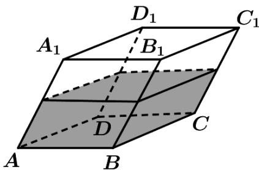
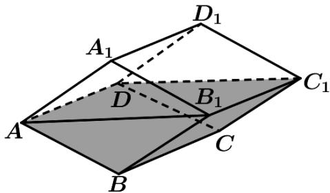
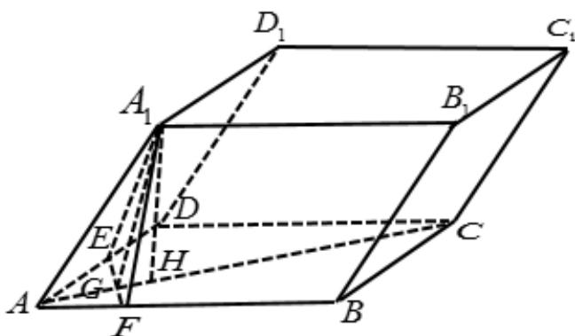

> [!faq]- 《专题19 空间直线、平面的垂直-线面垂直（高效培优期中专项训练）数学人教A版高一必修第二册》官方解析
>
> > [!success]- **【答案】** B
>
> > [!note]- **【解析】**
> > 
> >
> > 
> >
> > 图(1) 图(2) A. $\frac{\sqrt{3}}{3}$ B. $\frac{\sqrt{6}}{3}$ C. $\frac{2\sqrt{3}}{3}$ D. $\frac{2\sqrt{6}}{3}$
> >
> > 【答案】B
> >
> > 
> >
> > 如图：作 $A_{1}E \perp AD$ 于点 E，作 $A_{1}F \perp AB$ 于点 F，
> >
> > 因为 $\angle A_{1}AD = \angle A_{1}AB = 60^{\circ}$ ，则 $A_{1}E = A_{1}F = AA_{1}\sin 60^{\circ} = 2\times \frac{\sqrt{3}}{2} = \sqrt{3}$ $AE = AF = AA_{1}\cos 60^{\circ} = 2\times \frac{1}{2} = 1$
> >
> > 又因为 $\angle EAF = \angle BAD = 60^{\circ}$ ，所以 $\triangle AEF$ 为等边三角形，则 $EF = AE = 1$ 取 $EF$ 的中点 $G$ ，连接 $AG$ ， $A_{1}G$ ，则 $AG\perp EF$ ， $A_{1}G\perp EF$
> >
> > $$
> > E G = F G = \frac {1}{2} E F = \frac {1}{2}
> > $$
> >
> > 因为 $AG \cap A_{1}G = G$ ，所以 $EF \perp$ 面 $AA_{1}G$
> >
> > 则 $AG = \sqrt{AF^2 - GF^2} = \sqrt{1 - \left(\frac{1}{2}\right)^2} = \frac{\sqrt{3}}{2}$
> >
> > $$
> > A _ {1} G = \sqrt {A _ {1} E ^ {2} - E G ^ {2}} = \sqrt {\left(\sqrt {3}\right) ^ {2} - \left(\frac {1}{2}\right) ^ {2}} = \frac {\sqrt {1 1}}{2}
> > $$
> >
> > 由余弦定理可得： $\cos \angle A_{1}AG = \frac{AA_{1}^{2} + AG^{2} - A_{1}G^{2}}{2AA_{1}\cdot AG} = \frac{4 + \frac{3}{4} - \frac{11}{4}}{2\times 2\times\frac{\sqrt{3}}{2}} = \frac{\sqrt{3}}{3}$
> >
> > 所以 $\sin \angle A_{1}AG = \sqrt{1 - \cos^{2}\angle A_{1}AG} = \sqrt{1 - \left(\frac{\sqrt{3}}{3}\right)^{2}} = \frac{\sqrt{6}}{3}$
> >
> > 作 $A_{1}H \perp AG$ 于点 $H$ ，因为 $EF \perp$ 面 $AA_{1}G$ ， $A_{1}H \subset$ 面 $AA_{1}G$
> >
> > $$
> > E F \perp A _ {1} H
> > $$
> >
> > $$
> > A G \cap E F = G
> > $$
> >
> > $$
> > A _ {1} H \perp
> > $$
> >
> > 所以点 $A_{1}$ 到面ABCD的距离为 $d = A_{1}H = AA_{1}\sin \angle AA_{1}G = 2\times \frac{\sqrt{6}}{3} = \frac{2\sqrt{6}}{3}$
> >
> > 故平面 $A_{1}B_{1}C_{1}D_{1}$ 到平面ABCD的距离为 $d = \frac{2\sqrt{6}}{3}$
> >
> > $$
> > A B C D - A _ {1} B _ {1} C _ {1} D _ {1}
> > $$
> >
> > 所以 $h = \frac{1}{2} d = \frac{\sqrt{6}}{3}$
> >
> > 故选：B.
> >
> > ## 考点08求线面角
