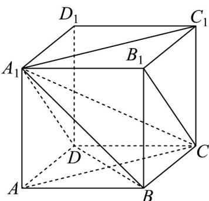

> [!faq]- 《专题19 空间直线、平面的垂直-线面垂直（高效培优期中专项训练）数学人教A版高一必修第二册》官方解析
>
> > [!success]- **【答案】** A. $A_{1}C_{1}\perp BD$ B. $B_{1}C$ 与BD所成的角为 $60^{\circ}$ C. $A_{1}C$ 与平面ABCD所成的角为 $45^{\circ}$ D. 三棱锥 $A_{1}-ABD$ 的外接球半径为 $\frac{\sqrt{3}}{2}$
>
> > [!note]- **【解析】**
> > 选项 A，∵ $ABCD - A_{1}B_{1}C_{1}D_{1}$ 是正方体，∴ ABCD 是正方形，∴ $AC \perp BD$
> >
> > ∵ $AC // A_{1}C_{1}$ ，∴ $A_{1}C_{1} \perp BD$ ，∴ 选项 A 正确；
> >
> > 
> >
> > 选项 B，∵ $ABCD - A_{1}B_{1}C_{1}D_{1}$ 是正方体，∴ $A_{1}D // B_{1}C$ ，∴ $\angle A_{1}DB$ 为 $B_{1}C$ 和 BD 所成的角，
> >
> > 又 $Q^{\triangle}A_{1}DB$ 为等边三角形， $\therefore \angle A_1DB = 60^\circ$
> >
> > $\therefore B_{1}C$ 和 $BD$ 所成的角为 $60^{\circ}$ ， $\therefore$ 选项 ${}^{\mathrm{B}}$ 正确；
> >
> > 选项 C，∵ $ABCD - A_{1}B_{1}C_{1}D_{1}$ 是正方体，∴ $AA_{1} \perp$ 平面 ABCD，
> >
> > $\therefore \angle ACA_{1}$ 为 $A_{1}C$ 与平面ABCD所成的角，
> >
> > ∵ 正方体 $ABCD - A_{1}B_{1}C_{1}D_{1}$ 的棱长为 1，∴ $AC = \sqrt{2}$
> >
> > 在 $\mathrm{Rt}\triangle ACA_1$ 中， $\tan \angle ACA_1 = \frac{AA_1}{AC} = \frac{1}{\sqrt{2}} \neq 1$ ， $\therefore \angle ACA_1 \neq 45^\circ$ ， $\therefore$ 选项C错误；
> >
> > 选项D，∵三棱锥 $A_{1} - ABD$ 的外接球就是正方体 $ABCD - A_{1}B_{1}C_{1}D_{1}$ 的外接球，
> >
> > 三棱锥 $A_{1} - ABD$ 的外接球的半径为 $\frac{1}{2}\sqrt{1 + 1 + 1} = \frac{\sqrt{3}}{2}$ ，选项D正确
> >
> > 故选 **ABD**.
