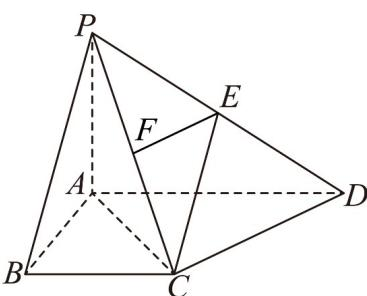

> [!faq]- 《专题19 空间直线、平面的垂直-线面垂直（高效培优期中专项训练）数学人教A版高一必修第二册》官方解析
>
> > [!success]- **【答案】** (1)证明见解析 (2) $\frac{\sqrt{10}}{5}$
>
> > [!note]- **【解析】**
> > （1）因为 $PA \perp$ 平面ABCD， $CD \subset$ 平面ABCD，所以 $PA \perp CD$
> >
> > 又四边形 ABCD 为直角梯形，且 $\angle ABC = \angle BAD = 90^{\circ}$ ， $BC = \frac{1}{2} AD$ ，
> >
> > 则 $AC^2 = AB^2 +BC^2 = 2$ ，所以 $AC = \sqrt{2}$
> >
> > 因为 $AB = BC = 1$ ，所以 $\angle BAC = 45^{\circ}$ ，所以 $\angle DAC = 45^{\circ}$
> >
> > 在 $\triangle ACD$ 中，由余弦定理可得 $CD^2 = AC^2 + AD^2 - 2AC \cdot AD \cdot \cos \angle DAC = 2$
> >
> > 所以 $AC^2 + CD^2 = AD^2$ ，即 $DC \perp AC$
> >
> > 因为 $AC \cap PA = A$ ，AC， $PC \subset$ 平面 PAC，所以 $DC \perp$ 平面 PAC。
> >
> > (2) 取 PC 的中点 F，连接 EF，
> >
> > 
> >
> > 因为 E 为 PD 的中点，所以 $EF \parallel CD$ ，由（1）知 $DC \perp$ 平面 PAC，则 $EF \perp$ 平面 PAC
> >
> > 所以 $\angle ECF$ 为直线 $EC$ 与平面 $PAC$ 所成的角.
> >
> > 又 $CF \subset$ 平面 PAC ，所以 $EF \perp CF$
> >
> > 因为 $CF = \frac{1}{2} PC = \frac{1}{2}\sqrt{1^2 + (\sqrt{2})^2} = \frac{\sqrt{3}}{2}$ ， $EF = \frac{1}{2} CD = \frac{\sqrt{2}}{2}$ ，
> >
> > 又 $CE = \sqrt{CF^{2} + FE^{2}} = \frac{\sqrt{5}}{2}$ ，
> >
> > 所以 $\sin\angle ECF=\frac{EF}{CE}=\frac{\frac{\sqrt{2}}{2}}{\frac{\sqrt{5}}{2}}=\frac{\sqrt{10}}{5}$
> >
> > 所以直线 $EC$ 与平面 $PAC$ 所成角的正弦值为 $\frac{\sqrt{10}}{5}$ .
