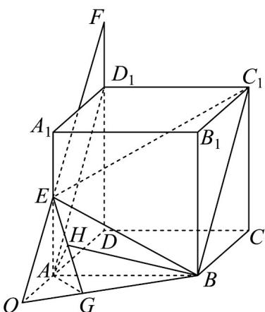

> [!faq]- 《专题19 空间直线、平面的垂直-线面垂直（高效培优期中专项训练）数学人教A版高一必修第二册》官方解析
>
> > [!success]- **【答案】** (1)证明见解析 (2) $\frac{1}{3}$
>
> > [!note]- **【解析】**
> > （1）连接 $EF, AD_1$ ，由 $2\overline{FD}_1 = \overline{D}_1\overline{D}$ ，知 $FD_1 // AA_1$ ，且 $FD_1 = \frac{1}{2} AA_1$
> >
> > 因为 $E$ 为 $AA_{1}$ 的中点，所以 $AE = \frac{1}{2} AA_{1}$
> >
> > 所以 $FD_{1} //EA$ ，且 $FD_{1} = EA$ ，所以四边形 $FEAD_{1}$ 为平行四边形，
> >
> > 所以 $EF \parallel AD_{1}$
> >
> > 因为 $AB \parallel D_{1}C_{1}, AB = D_{1}C_{1}$ ，所以四边形 $ABC_{1}D_{1}$ 为平行四边形，
> >
> > 所以 $AD_{1} / / BC_{1}$
> >
> > 所以 $EF \parallel BC_{1}$ ，故 E, F, B, $C_{1}$ 四点共面.
> >
> > (2) 延长 $FE$ 交 $DA$ 与 $O$ , 连接 $BO$ , 则 $AB$ 与面 $EBC_{1}$ 所成角就是 $AB$ 与面 $EOB$ 所成角.
> >
> > 过 A 作 $AG \perp BO$ 交 BO 与 G ，连接 EG ，过 A 作 $AH \perp EG$ 与 H ，连接 BH ，
> >
> > 因为 $AA_{1} \perp$ 平面 ABCD ，BO ⊂ 平面 ABCD ，所以 EA ⊥ BO ，
> >
> > 因为 $AG \cap EA = A$ ， $AG, EA \subset$ 平面 $EAG$ ，所以 $BO \perp$ 平面 $EAG$
> >
> > 因为 $AH \subset$ 平面 $EAG$ ，所以 $BO \perp AH$
> >
> > 因为 $BO \cap EG = G$ ， $BO,EG \subset$ 平面 $EOB$
> >
> > 所以 $AH \perp$ 平面 $EOB$
> >
> > 所以 $\angle ABH$ 就是 $AB$ 与面 $EOB$ 所成角·
> >
> > 令 $AD = 2$ ，由 $EA // DD_{1}, EA = \frac{1}{3} FD$ ，得 $AO = 1$
> >
> > 在 Rt $\triangle OAB$ 中，由等面积法可求得 $AG = \frac{AB \cdot AO}{OB} = \frac{2 \times 1}{\sqrt{2^{2} + 1^{2}}} = \frac{2\sqrt{5}}{5}$ ，
> >
> > 同理在 Rt 中， $AH = \frac{AE \cdot AG}{EG} = \frac{1 \times \frac{2\sqrt{5}}{5}}{\sqrt{1^{2} + \left(\frac{2\sqrt{5}}{5}\right)^{2}}} = \frac{2}{3}$
> >
> > 在 Rt $\triangle ABH$ 中， $\sin\angle ABH=\frac{AH}{AB}=\frac{1}{3}$ ，
> >
> > 故直线 $AB$ 平面 $EBC_{1}$ 所成角的正弦值为 $\frac{1}{3}$ .
> >
> > 
