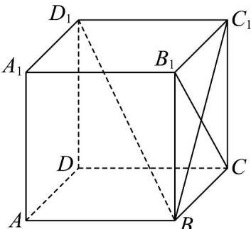

> [!faq]- 《专题19 空间直线、平面的垂直-线面垂直（高效培优期中专项训练）数学人教A版高一必修第二册》官方解析
>
> > [!success]- **【答案】** $45^{\circ}$ $90^{\circ}$
>
> > [!note]- **【解析】**
> > 如图所示，有正方体可知， $BB_{1} // AA_{1}$
> >
> > 所以 $\angle BB_{1}C$ 是异面直线 $AA_{1}$ 与 $B_{1}C$ 所成的角，
> >
> > 由等腰直角三角形 $BB_{1}C$ 可得， $\angle BB_{1}C = 45^{\circ}$ ;
> >
> > 
> >
> > 由正方体可得， $D_{1}C_{1}\perp$ 平面 $BCC_{1}B_{1}$ ，所以 $D_{1}C_{1}\perp B_{1}C$
> >
> > 又在正方形 $BCC_{1}B_{1}$ 中， $B_{1}C \perp BC_{1}$
> >
> > 又 $D_{1}C_{1}$ 与 $BC_{1}$ 相较于点 $C_{1}$ ，所以 $B_{1}C \perp$ 平面 $ABC_{1}D_{1}$
> >
> > 所以 $B_{1}C$ 与平面 $ABD_{1}$ 所成的角为 $90^{\circ}$
> >
> > 故答案为： $45^{\circ}$ ; $90^{\circ}$ .
