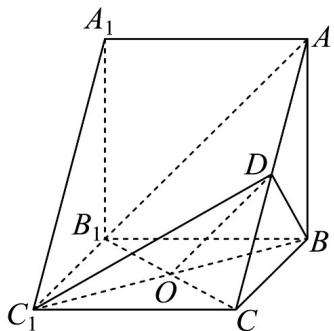

> [!faq]- 《专题19 空间直线、平面的垂直-线面垂直（高效培优期中专项训练）数学人教A版高一必修第二册》官方解析
>
> > [!success]- **【答案】** $^{(1)}$ 证明见解析 (2)证明见解析 (3) $\frac{\pi}{6}$
>
> > [!note]- **【解析】**
> > （1）连接 $B_{1}C$ 交 $BC_{1}$ 于点 $O$ ，连接 $OD$
> >
> > 因为四边形 $BCC_{1}B_{1}$ 为正方形，所以 $O$ 为 $B_{1}C$ 的中点.
> >
> > 因为 $D$ 为 $AC$ 的中点，所以 $OD \parallel AB_{1}$
> >
> > 因为 $AB_{1} \notin$ 平面 $BC_{1}D$ ， $OD \subset$ 平面 $BC_{1}D$ ，所以 $AB_{1} \parallel$ 平面 $BC_{1}D$
> >
> > 
> >
> > (2) 由题意可得 $AA_{1} \perp$ 平面 $ABC$ ，又 $BD \subset$ 平面 $ABC$ ，
> >
> > 所以 $AA_{1} \perp BD$ ，又 $D$ 为 $AC$ 的中点， $AB = BC = 2$ ，所以 $AC \perp BD$
> >
> > 因为 $AA_{1} \perp BD$ ， $AC \perp BD$ ， $AA_{1} \cap AC = A, AA_{1}, AC \subset$ 平面 $AA_{1}C_{1}C$
> >
> > 所以 $BD \perp$ 平面 $AA_{1}C_{1}C$ .
> >
> > (3) 由 (2) 知 $BD \perp$ 平面 $AA_{1}C_{1}C$ ，所以直线 $BC_{1}$ 在平面 $AA_{1}C_{1}C$ 的射影为 $DC_{1}$
> >
> > 所以 $\angle DC_{1}B$ 即为所求的线面角，
> >
> > 在VABC中， $AB = BC = 2$ ， $AB\bot BC$ ， $D$ 为 $AC$ 的中点，
> >
> > 所以 $BD = \frac{1}{2} AC = \frac{1}{2}\times 2\sqrt{2} = \sqrt{2}$ ，所以 $AC\bot BD$
> >
> > 在直角三角形 $DC_{1}C$ 中， $DC_{1} = \sqrt{C_{1}C^{2} + CD^{2}} = \sqrt{4 + 2} = \sqrt{6}$
> >
> > 故在直角三角形 $DC_{1}B$ 中， $\tan \angle DC_1B = \frac{BD}{DC_1} = \frac{\sqrt{3}}{3}$
> >
> > 又 $\angle DC_{1}B\in \left[0,\frac{\pi}{2}\right]$ ，所以 $\angle DC_1B = \frac{\pi}{6}$ ，即直线 $BC_{1}$ 与平面 $AA_{1}C_{1}C$ 所成角为 $\frac{\pi}{6}\cdot$
> >
> > ## 考点09由线面角的大小求值
