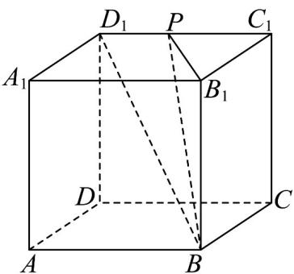
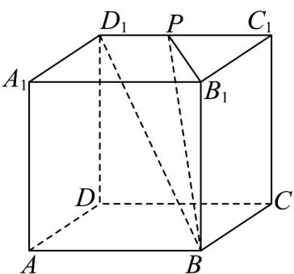

> [!faq]- 《专题19 空间直线、平面的垂直-线面垂直（高效培优期中专项训练）数学人教A版高一必修第二册》官方解析
>
> > [!success]- **【答案】**  A. 存在点 $P$ 使得 $AC_{1} \perp$ 平面 $BB_{1}P$ B. 存在点 $P$ 使得 $AA_{1} //$ 平面 $BB_{1} P$ C. 若 $P$ 是 $C_{1}D_{1}$ 的中点，则 $DD_{1}$ 到平面 $BB_{1}P$ 的距离为 $\frac{4\sqrt{5}}{5}$ D．若直线 $BD_{1}$ 与平面 $BB_{1}P$ 所成角的正弦值为 $\frac{\sqrt{3}}{15}$ ，则 $D_{1}P = \frac{4}{5}$
>
> > [!note]- **【解析】**
> > $^{A}$ .在正方体中易知， $BB_{1}$ 与 $AC_{1}$ 不垂直，故 $^{A}$ 不正确；
> >
> > B. 因为 $AA_{1} \parallel BB_{1}$ ，又 $AA_{1} \not\subset$ 平面 $BB_{1}P$ 并且 $BB_{1} \subset$ 平面 $BB_{1}P$ ，所以 $AA_{1} \parallel$ 平面 $BB_{1}P$ ，故 B 正确；
> >
> > C. 正方体中易知， $DD_{1} \parallel BB_{1}$ ， $DD_{1}$ 不在平面 $BB_{1}P$ 内， $BB_{1}$ 在平面 $BB_{1}P$ 内，所以 $DD_{1} \parallel$ 平面 $BB_{1}P$
> >
> > 所以 $DD_{1}$ 到平面 $BB_{1}P$ 的距离即为 $D_{1}$ 到平面 $BB_{1}P$ 的距离，
> >
> > 在正方体中，易知平面 $BB_{1}P \perp$ 平面 $A_{1}B_{1}C_{1}D_{1}$ ，且相交于 $B_{1}P$
> >
> > 所以 $D_{1}$ 到平面 $BB_{1}P$ 的距离即为 $D_{1}$ 到 $B_{1}P$ 的距离，
> >
> > 又因为点 $P$ 是 $C_1D_1$ 的中点，所以点 $D_{1}$ 到直线 $B_{1}P$ 的距离等于点 $C_1$ 到直线 $B_{1}P$ 的距离，
> >
> > 又 $B_{1}P = 2\sqrt{5}$ ， $\frac{1}{2} B_1C_1\times C_1P = \frac{1}{2} d_{C_1 - PB_1}\times B_1P$ ，解得 $d = \frac{4\sqrt{5}}{5}$ ，故C正确；
> >
> > D. 设 $D_{1}P = x$ （ $0 < x \leq 4$ ），所以 $C_{1}P = 4 - x$
> >
> > 因为 $BB_{1} \perp$ 平面 $A_{1}B_{1}C_{1}D_{1}$ ，且 $BB_{1} \subset$ 平面 $BB_{1}P$ ，所以平面 $BB_{1}P \perp$ 平面 $A_{1}B_{1}C_{1}D_{1}$
> >
> > 且平面 $BB_{1}P \cap$ 平面 $A_{1}B_{1}C_{1}D_{1} = PB_{1}$ ，所以点 $C_{1}$ 和 $D_{1}$ 到平面 $BB_{1}P$ 的距离就是到 $B_{1}P$ 的距离，
> >
> > 计算可得 $B_{1}P = \sqrt{C_{1}B_{1}^{2} + C_{1}P^{2}} = \sqrt{4^{2} + (4 - x)^{2}}$
> >
> > 所以 $d_{C_{1}-PB_{1}}=\frac{PC_{1}\times B_{1}C_{1}}{PB_{1}}=\frac{4(4-x)}{\sqrt{4^{2}+(4-x)^{2}}}$
> >
> > 可得 $d_{D_{1}-PB_{1}}=\frac{4(4-x)}{\sqrt{4^{2}+(4-x)^{2}}}\times\frac{x}{4-x}=\frac{4x}{\sqrt{4^{2}+(4-x)^{2}}}$ ，所以直线 $BD_{1}$ 与平面 $BB_{1}P$ 所成角的正弦为
> >
> > $\frac{d_{D_{1}-PB_{1}}}{BD_{1}}=\frac{\frac{4x}{\sqrt{4^{2}+(4-x)^{2}}}}{4\sqrt{3}}=\frac{\sqrt{3}}{15}$ ，所以 $x=1$ ，故D错误·
> >
> > 
> >
> > 故选 **BC**
