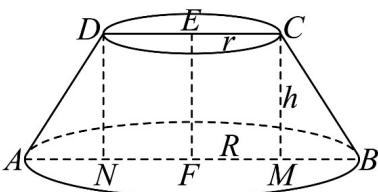
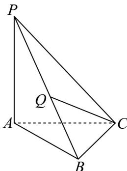
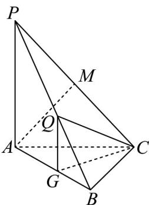

> [!faq]- 《专题19 空间直线、平面的垂直-线面垂直（高效培优期中专项训练）数学人教A版高一必修第二册》官方解析
>
> > [!success]- **【答案】** $\frac{14\sqrt{2}}{3}\pi$
>
> > [!note]- **【解析】**
> > 如下图所示，在圆台 EF 中，设该圆台上、下底面的半径分别为 r 、 R ，高为 h ，
> >
> > 
> >
> > 取圆台的轴截面 ABCD，可知四边形 ABCD 为等腰梯形，
> >
> > 过点 D 、 C 在平面 ABCD 内作 DN ⊥ AB ， CM ⊥ AB ，垂足分别为 N 、 M
> >
> > 由题意可知， $\angle DAN = \angle CBM = 45^{\circ}$ ，则 $\triangle ADN$ 、 $\triangle BCM$ 都为等腰直角三角形，
> >
> > 故 $AN = DN = \sqrt{2}$ ， $BM = CM = \sqrt{2}$ ，则 $AD = \sqrt{2} AN = 2$ ， $BC = \sqrt{2} BM = 2$
> >
> > 在平面 ABCD 内，因为 CD//AB ， DN ⊥ AB ， CM ⊥ AB
> >
> > 则四边形 $CDNM$ 为矩形，故 $MN = CD = 2r$
> >
> > 由题意可知，梯形 ABCD 的周长为 $AB + CD + AD + BC = 6\sqrt{2} + 4$
> >
> > 即 $\left(2r + 2\sqrt{2}\right) + 2r + 4 = 4r + 2\sqrt{2} + 4 = 6\sqrt{2} + 4$ ，解得 $r = \sqrt{2}$
> >
> > 故 $R = \frac{AB}{2} = r + \sqrt{2} = 2\sqrt{2}$
> >
> > 因此，该圆台的体积为 $V = \frac{1}{3}\pi (r^2 +Rr + R^2)h = \frac{1}{3}\pi \times (2 + 4 + 8)\times \sqrt{2} = \frac{14\sqrt{2}}{3}\pi .$ 故答案为： $\frac{14\sqrt{2}}{3}\pi .$
> >
> > 44. 离散曲率是刻画空间弯曲性的重要指标．设 P 为多面体 M 的一个顶点，定义多面体 M 在点 P 处的离散曲率为 $\varphi_{P}=1-\frac{1}{2\pi}\left(\angle Q_{1}PQ_{2}+\angle Q_{2}PQ_{3}+\cdots+\angle Q_{k-1}PQ_{k}+\angle Q_{k}PQ_{1}\right)$ ，其中 $Q_{i}(i=1,2,\cdots,k,k-3)$ 为多面体 M 的所有与点 P 相邻的顶点，且平面 $Q_{1}PQ_{2}$ ，平面 $Q_{2}PQ_{3}$ ，…，平面 $Q_{k-1}PQ_{k}$ 和平面 $Q_{k}PQ_{1}$ 为多面体 M 的所有以 P 为公共点的面．已知三棱锥 P-ABC 如图所示．
> >
> > 
> >
> > (1)求三棱锥 P-ABC 在各个顶点处的离散曲率的和；
> >
> > (2)若 $PA \perp$ 平面 $ABC$ ， $AC \perp BC$ ， $AC = BC = 4$ ，三棱锥 $P - ABC$ 在顶点 $C$ 处的离散曲率为 $\frac{3}{8}$ ，求点 $A$ 到平面 $PBC$ 的距离；
> >
> > (3)在 $(2)$ 的前提下，又知点Q在棱PB上，直线CQ与平面ABC所成角的余弦值为 $\frac{\sqrt{30}}{6}$ ，求BQ的长度.
> > 【答案】 $^{(1)2}$ (2) $2\sqrt{2}$ (3) $\frac{4\sqrt{3}}{3}$
> >
> > 【详解】（1）根据离散曲率的定义得 $\varphi_{P} = 1 - \frac{1}{2\pi}\bigl (\angle APB + \angle BPC + \angle APC\bigr)$ $\varphi_{A} = 1 - \frac{1}{2\pi}\bigl (\angle PAB + \angle BAC + \angle PAC\bigr),\varphi_{B} = 1 - \frac{1}{2\pi}\bigl (\angle PBA + \angle ABC + \angle PBC\bigr)$ ， $\varphi_{C} = 1 - \frac{1}{2\pi}\bigl (\angle PCA + \angle BCA + \angle PCB\bigr)$
> >
> > 又因为 $\angle APB + \angle BPC + \angle APC + \angle PAB + \angle BAC + \angle PAC + \angle PBA + \angle ABC + \angle PBC$
> >
> > $$
> > + \angle P C A + \angle B C A + \angle P C B = 4 \pi
> > $$
> >
> > 所以 $\varphi_{P} + \varphi_{A} + \varphi_{B} + \varphi_{C} = 4 - \frac{1}{2\pi}\times 4\pi = 2$
> >
> > (2) $\because PA \perp$ 平面 $ABC, BC \subset$ 平面 $ABC$ , $\therefore PA \perp BC$ ,
> >
> > 又∵ $AC \perp BC, PA \cap AC = A$ ，PA, $AC \subset$ 平面 PAC，∴ $BC \perp$ 平面 PAC，
> >
> > $\because PC \subset$ 平面 $PAC, \therefore BC \perp PC$
> >
> > $$
> > \because \varphi_ {C} = 1 - \frac {1}{2 \pi} \Big (\angle P C A + \angle B C A + \angle P C B \Big) = \frac {3}{8}, \text {即} 1 - \frac {1}{2 \pi} \Bigg (\angle P C A + \frac {\pi}{2} + \frac {\pi}{2} \Bigg) = \frac {3}{8}
> > $$
> >
> > $\therefore \angle PCA = \frac{\pi}{4}$ ， $\therefore PA = AC = BC = 4$ ，过点 $A$ 作 $AM\perp PC$ 于点 $M$
> >
> > 由 $BC \perp$ 平面 $PAC, AM \subset$ 平面 $PAC$ ，得 $BC \perp AM$
> >
> > 又 $BC \cap PC = C, BC, PC \subset$ 平面 $PCB$ ，则 $AM \perp$ 平面 $PCB$ ，
> >
> > 因此点 A 到平面 PBC 的距离为线段 AM 的长，在 Rt△ACM 中， $AM = AC \sin \angle PCA = 4 \times \frac{\sqrt{2}}{2} = 2\sqrt{2}$ ，
> > ∴点 A 到平面 PBC 的距离为 $2\sqrt{2}$ .
> >
> > (3) 过点 $Q$ 作 $QG \parallel PA$ 交 $AB$ 于 $G$ , 连结 $CG$ ,
> >
> > 
> >
> > ∵PA⊥平面ABC，∴QG⊥平面ABC
> >
> > $\therefore \angle G C Q$ 为直线 $CQ$ 与平面 $A B C$ 所成的角，
> >
> > 依题意可得， $PA = 4,AB = \sqrt{AC^2 + BC^2} = \sqrt{4^2 + 4^2} = 4\sqrt{2}$
> >
> > $$
> > P B = \sqrt {P A ^ {2} + A B ^ {2}} = \sqrt {4 ^ {2} + (4 \sqrt {2}) ^ {2}} = 4 \sqrt {3}
> > $$
> >
> > $\sin \angle PBA = \frac{PA}{PB} = \frac{\sqrt{3}}{3},\cos \angle PBA = \frac{AB}{PB} = \frac{\sqrt{6}}{3},$
> >
> > 设 $BQ = x(0 < x \leq 4\sqrt{3})$ ，则 $QG = BQ\sin \angle PBA = \frac{\sqrt{3}}{3}x, BG = BQ \cdot \cos \angle PBA = \frac{\sqrt{6}}{3}x$ ，
> >
> > 在 $\triangle BCG$ 中， $CG = \sqrt{BC^2 + BG^2 - 2BC \cdot BG \cdot \cos \angle CBG} = \sqrt{16 + \frac{2}{3}x^2 - 2 \times 4 \cdot \frac{\sqrt{6}}{3}x \cdot \frac{\sqrt{2}}{2}} = \sqrt{16 + \frac{2}{3}x^2 - \frac{8\sqrt{3}}{3}x}$ 又 $\cos \angle GCQ = \frac{\sqrt{30}}{6}$ ，所以 $\sin \angle GCQ = \sqrt{1 - \cos^2\angle GCQ} = \frac{\sqrt{6}}{6}$ 则 $\tan \angle GCQ = \frac{\sin \angle GCQ}{\cos \angle GCQ} = \frac{\sqrt{5}}{5}$ $\therefore \tan \angle GCQ = \frac{QG}{CG} = \frac{\frac{\sqrt{3}}{3}x}{\sqrt{16 + \frac{2}{3}x^2 - \frac{8\sqrt{3}}{3}x}} = \frac{\sqrt{5}}{5}$ ，解得： $x = \frac{4\sqrt{3}}{3}$ 或 $x = -4\sqrt{3}$ （舍），故 $BQ = \frac{4\sqrt{3}}{3}$ .
