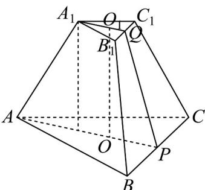

> [!faq]- 《专题19 空间直线、平面的垂直-线面垂直（高效培优期中专项训练）数学人教A版高一必修第二册》官方解析
>
> > [!success]- **【答案】** A
>
> > [!note]- **【解析】**
> > 在正三棱台 $ABC - A_{1}B_{1}C_{1}$ 中，令 $BC$ 和 $B_{1}C_{1}$ 的中点分别为 $P, Q$ ，上、下底面的中心分别为 $O_{1}, O$
> >
> > 
> >
> > 则 $O_{1}A_{1} = \frac{2}{3}\times \frac{\sqrt{3}}{2} A_{1}B_{1} = \frac{\sqrt{3}}{3},OA = \frac{2\sqrt{3}}{3}$ ，由侧棱 $AA_{1}$ 与底面ABC所成角的余弦值为 $\frac{\sqrt{3}}{3}$ 得 $AA_{1} = \frac{OA - O_{1}A_{1}}{\frac{\sqrt{3}}{3}} = 1$ ，则 $O_{1}O = \sqrt{AA_{1}^{2} - (OA - O_{1}A_{1})^{2}} = \frac{\sqrt{6}}{3}$ 而 $OP = \frac{1}{2} OA = \frac{\sqrt{3}}{3},O_1Q = \frac{1}{2} O_1A_1 = \frac{\sqrt{3}}{6}$ ，则 $PQ = \sqrt{OO_1^2 + (OP - O_1Q)^2} = \frac{\sqrt{3}}{2}$
> >
> > $$
> > S _ {\triangle A B C} = \frac {\sqrt {3}}{4} A B ^ {2} = \sqrt {3}, S _ {\triangle A _ {1} B _ {1} C _ {1}} = \frac {\sqrt {3}}{4} A _ {1} B _ {1} ^ {2} = \frac {\sqrt {3}}{4}, S _ {B C C _ {1} B _ {1}} = \frac {1}{2} (B C + B _ {1} C _ {1}) \cdot P Q = \frac {3 \sqrt {3}}{4},
> > $$
> >
> > 正三棱台三个侧面都是面积相等的等腰梯形，于是侧面积为 $\frac{9\sqrt{3}}{4}$
> >
> > 所以此棱台的表面积是 $S=\frac{9\sqrt{3}}{4}+\frac{\sqrt{3}}{4}+\sqrt{3}=\frac{7\sqrt{3}}{2}$ .
> >
> > 故选 **A**
