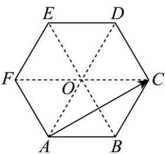

> [!faq]- 《专题20 平面向量精选压轴60题12类考点专练（高效培优期中专项训练）数学人教A版高一必修第二册_57404409》官方解析
>
> > [!success]- **【答案】** A
>
> > [!note]- **【分析】**
> > 连接 AD 、 BE 、 CF 交于点 O ，分析可知 $FC = 2AB$ ，再利用平面向量加法的三角形法则可得答案.
>
> > [!note]- **【解析】**
> > 连接 AD、BE、CF 交于点 O，如下图所示：
> >
> > 
> >
> > 由正六边形的几何性质可知 $\triangle OAB$ 、 $\triangle OBC$ 、 $\triangle OCD$ 、 $\triangle ODE$ 、 $\triangle OEF$ 、 $\triangle OFA$ 均为等边三角形，因为 $OF = AF = AB = OB$ ，故四边形 $ABOF$ 为菱形，
> >
> > 同理可知，四边形 $ABCO$ 也为菱形，所以 $\overline{FO} = \overline{AB} = \overline{OC}$ ，故 $FC = 2AB$
> >
> > 故 $AC = AF + FC = AF + 2AB$
> >
> > 故选 **A**.
