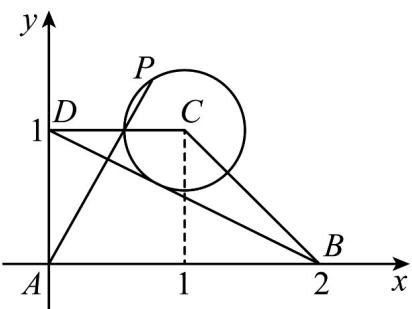

> [!faq]- 《专题20 平面向量精选压轴60题12类考点专练（高效培优期中专项训练）数学人教A版高一必修第二册_57404409》官方解析
>
> > [!success]- **【答案】** 4
>
> > [!note]- **【分析】**
> > 建立直角坐标系，写出点的坐标，求出 $BD$ 的方程，求出圆的方程，设出 $P(x,y)$ ，求出三个向
> >
> > 量的坐标，用 P 的坐标表 $\mu, \lambda$ ，则 $\frac{\lambda}{\mu} = 2 \cdot \frac{y}{x} = 2 \cdot \frac{y - 0}{x - 0}$ ，根据直线 AP: $y = kx$ 与 $(x - 1)^{2} + (y - 1)^{2} = \frac{1}{5}$ 有交点，
> >
> > 求出范围.
>
> > [!note]- **【解析】**
> > 解：以 A 为原点，分别以 AB, AD 方向为 x, y 轴，建立如图所示直角坐标系：
> >
> > 
> >
> > 所以 $A(0,0)$ ， $B(2,0)$ ， $C(1,1)$ ， $D(0,1)$ ，所以 $AD=(0,1)$ ， $AB=(2,0)$
> >
> > 因为圆 C 与直线 BD 相切，而 $l_{BD}: x + 2y - 2 = 0$ ，圆心 $C(1,1)$
> >
> > 所以半径 $r = \frac{1}{\sqrt{5}} = \frac{\sqrt{5}}{5}$ ，所以圆 $C:\left(x - 1\right)^2 +\left(y - 1\right)^2 = \frac{1}{5}$
> >
> > 设 $P(x,y)$ ，则 $\overline{AP} = (x,y)$ ， $\overline{AD} = (0,1)$ ， $\overline{AB} = (2,0)$
> >
> > 又 $AP = \lambda AD + \mu AB = \lambda (0,1) + \mu (2,0) = (2\mu ,\lambda)$
> >
> > 所以 $(x,y) = (2\mu ,\lambda)$ ，则 $x = 2\mu ,y = \lambda$ ，所以 $\mu = \frac{x}{2},\lambda = y$
> >
> > 所以 $\frac{\lambda}{\mu} = 2 \cdot \frac{y}{x} = 2 \cdot \frac{y - 0}{x - 0}$ 表示坐标原点 $A$ 与点 $P$ 两点之间连线的斜率 $k$ 的2倍，
> >
> > 因为动点 P 在圆 C 上移动，所以直线 AP: $y = kx$ 与 $(x - 1)^{2} + (y - 1)^{2} = \frac{1}{5}$ 有交点，
> >
> > 则圆心 $C(1,1)$ 到 $y = kx$ 的距离为 $\frac{|k - 1|}{\sqrt{k^2 + 1^2}} \leqslant \sqrt{\frac{1}{5}}$
> >
> > 解得: $\frac{1}{2}\leq k\leq2$ ，则 $1\leq2\cdot\frac{y}{x}\leq4$
> >
> > 所以 $1 \leq \frac{\lambda}{\mu} \leq 4$ $\frac{\lambda}{\mu}$ ，则最大值是4.
> >
> > 故答案为：4.
