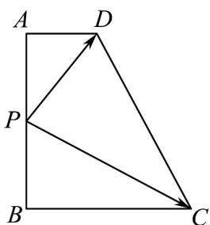
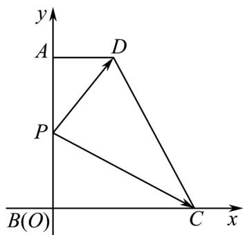

> [!faq]- 《专题20 平面向量精选压轴60题12类考点专练（高效培优期中专项训练）数学人教A版高一必修第二册_57404409》官方解析
>
> > [!success]- **【答案】** 
>
> > [!note]- **【分析】**
> > 以 B 点为坐标原点，建立平面直角坐标系，设 $AB = a, BP = x(0, x, a)$ ，写出各点坐标，结合向
> >
> > 量加法以及模的坐标运算，运用二次函数的知识即可求出最小值.
>
> > [!note]- **【解析】**
> > 如图，以 $B$ 点为坐标原点，建立平面直角坐标系，设 $AB = a, BP = x(0, x, a)$
> >
> > 因为 $AD = 1, BC = 2$ ，所以 $P(0, x), C(2, 0), D(1, a)$
> >
> > 所以 $PC = (2, -x), PD = (1, a - x), 4PD = (4, 4a - 4x)$
> >
> > 所以 $\overline{PC}+4\overline{PD}=(6,4a-5x)$ ，所以 $\left|\overline{PC}+4\overline{PD}\right|=\sqrt{36+(4a-5x)^{2}}..6$
> >
> > 所以当 $4a - 5x = 0$ ，即 $x = \frac{4}{5}a$ 时， $\left|PC + 4PD\right|$ 的最小值为 6.
> >
> > 
> >
> > 故答案为：6
