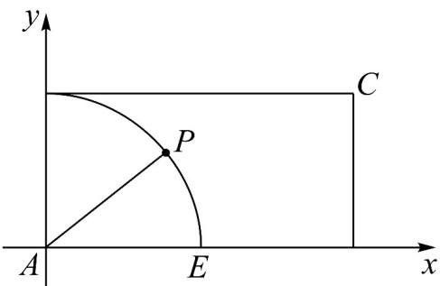

> [!faq]- 《专题20 平面向量精选压轴60题12类考点专练（高效培优期中专项训练）数学人教A版高一必修第二册_57404409》官方解析
>
> > [!success]- **【答案】** C
>
> > [!note]- **【分析】**
> > 构建直角坐标系，令 $AP = (\cos \theta, \sin \theta)$ ， $\theta \in [0, 2\pi)$ ，根据向量线性关系的坐标表示列方程组得
> >
> > $\left\{ \begin{array}{l} \cos \theta = 2\mu \\ \sin \theta = \lambda \end{array} \right.$ ，结合辅助角公式、正弦函数性质求最值.
>
> > [!note]- **【解析】**
> > 构建如下直角坐标系： $AB = (0,1),AD = (2,0)$ ，令 $AP = (\cos \theta ,\sin \theta)$ ， $\theta \in [0,2\pi)$
> >
> > 
> >
> > 由 $\overline{AP}=\lambda\overline{AB}+\mu\overline{AD}\left(\lambda,\mu\in\mathrm{R}\right)$ 可得： $\begin{cases}\cos\theta=2\mu\\\sin\theta=\lambda\end{cases}$
> >
> > 则 $\lambda +\mu = \sin \theta +\frac{\cos\theta}{2} = \frac{\sqrt{5}}{2}\sin (\theta +\varphi)$ 且 $\tan \varphi = \frac{1}{2}$
> >
> > 所以当 $\sin(\theta+\varphi)=1$ 时， $\lambda+\mu$ 的最大值为 $\frac{\sqrt{5}}{2}$
> >
> > 故选 **C**
