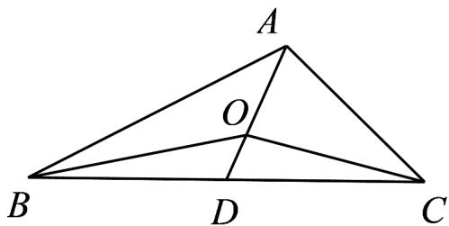
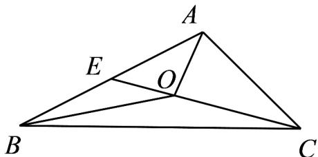

> [!faq]- 《专题20 平面向量精选压轴60题12类考点专练（高效培优期中专项训练）数学人教A版高一必修第二册_57404409》官方解析
>
> > [!success]- **【答案】** AD
>
> > [!note]- **【分析】**
> > 取 BC 的中点 D ，则 $\overline{OB} + \overline{OC} = 2\overline{OD}$ ，得 $2\overline{OD} = -\overline{OA}$ ，即可判断 A；若 $\left|\overline{OA}\right| = \left|\overline{OB}\right| = \left|\overline{OC}\right|$ ，则 O
> >
> > 为 $\mathrm{V}ABC$ 的外心，不一定是内心，即可判断B；由题意 $\left|\overline{AO}\right| = \frac{2}{3}\left|\overline{AD}\right|$ ，则 $3\overline{AO} = 2\overline{AD}$ ，即可判断C；取
> >
> > AB 的中点 E ，则 $OA + OB = 2OE$ ，得 $CO = 2OE$ ， $\left|OE\right| = \frac{1}{3}\left|CE\right|$ ，即可判断 D.
>
> > [!note]- **【解析】**
> > 取 BC 的中点 D，连接 OD，则 $OB + OC = 2OD$
> >
> > 若 $OA + OB + OC = 0$ ，则 $2OD = -OA$ ，则 $O,A,D$ 三点共线，且 $2\left|\overline{OD}\right| = \left|\overline{OA}\right|$
> >
> > 则 $O$ 为VABC的重心，故A正确；
> >
> > 
> >
> > 若 $\left|\overline{OA}\right|=\left|\overline{OB}\right|=\left|\overline{OC}\right|$ ，则 O 为 VABC 的外心，不一定是内心，故 B 错误；
> >
> > 若 $O$ 为 $\mathrm{V}ABC$ 的重心， $AD$ 是 $BC$ 边上的中线，则 $\left|\overline{AO}\right| = \frac{2}{3}\left|\overline{AD}\right|$ ，则 $3AO = 2AD$ ，故C错误；
> >
> > 取 AB 的中点 E，连接 OE，则 $OA + OB = 2OE$ ，
> >
> > 
> >
> > 若 $\overline{OA} +\overline{OB} = \overline{CO}$ ，则 $CO = 2OE$ ，则 $O,D,E$ 三点共线，且 $\left|\overline{OE}\right| = \frac{1}{3}\left|\overline{CE}\right|$
> >
> > 则 $S_{\triangle AOB} = \frac{1}{3} S_{\triangle ABC}$ ，故D正确.
> >
> > 故选 **AD**.
