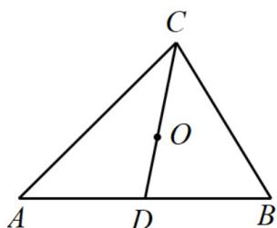

> [!faq]- 《专题20 平面向量精选压轴60题12类考点专练（高效培优期中专项训练）数学人教A版高一必修第二册_57404409》官方解析
>
> > [!success]- **【答案】** A
>
> > [!note]- **【分析】**
> > 设 $AB$ 中点为 $D$ ，进而结合向量加法法则与共线定理得 $O, D, C$ 三点共线， $O$ 在 $\mathrm{VABC}$ 的中线 $CD$
> >
> > 进而得 O 为 VABC 的重心，根据题意得点 P 为 VABC 的外接圆圆心，进而可得答案.
>
> > [!note]- **【解析】**
> > 解：设 $AB$ 中点为 $D$ ，因为 $\overline{OA} +\overline{OB} +\overline{OC} = 0$
> >
> > 所以 $OA + OB + OC = 2OD + OC = 0$ ，即 $-2OD = OC$
> >
> > 因为 $OD, OC$ 有公共点 O，
> >
> > 所以，O,D,C 三点共线，即 O 在 VABC 的中线 CD，
> >
> > 同理可得 O 在 VABC 的三条中线上，即为 VABC 的重心；
> >
> > 因为 $\left|PA\right|=\left|PB\right|=\left|PC\right|$
> >
> > 所以，点 $P$ 为 $\mathrm{VABC}$ 的外接圆圆心，即为 $\mathrm{VABC}$ 的外心
> >
> > 综上，点 O, P 依次是 VABC 的重心，外心.
> >
> > 故选：A
> >
> > 
