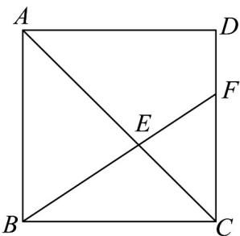

<!-- question-source:start -->
6. 在正方形 $ABCD$ 中， $F$ 是边 $CD$ 上靠近 $D$ 点的三等分点，连接 $BF$ 交 $AC$ 于点 $E$ ，若

$\overline{BE}=m\overline{AB}+n\overline{AC}(m,n\in R)$ ，则 m-n 的值为 \_\_\_\_。

<!-- question-source:end -->

![[高中/课堂同步/题库/人教A版高中数学同步讲义(2026)/02_必修第二册/期中专项训练+期中模拟卷/专题20 平面向量精选压轴60题12类考点专练（高效培优期中专项训练）数学人教A版高一必修第二册_57404409/题型二_向量的线性运算几何应用/questions/answers/Q00077397A1.md]]
