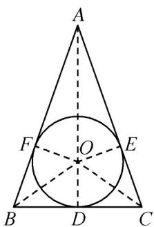
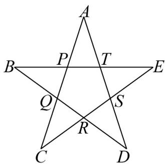

> [!faq]- 《专题20 平面向量精选压轴60题12类考点专练（高效培优期中专项训练）数学人教A版高一必修第二册_57404409》官方解析
>
> > [!success]- **【答案】** $\frac{2}{3}/2:3$
>
> > [!note]- **【分析】**
> > 取 $BC$ 的中点 $D$ ，则 $\overline{OD} = \frac{1}{2}\left(\overline{OB} +\overline{OC}\right)$ ，代入等式可证 $A,O,D$ 三点共线.设
> >
> > $OD = 1$ ，由直角三角形的性质以及三角形相似可求出各边长，从而求出比例关系.
>
> > [!note]- **【解析】**
> > 如图，设 BC 的中点 D，圆 O 与 AB, AC 分别相切于点 F, E，由 D 为 BC 的中点，知 $OD = \frac{1}{2} \left( OB + OC \right)$ .
> >
> > 又 $2OA + 3OB + 3OC = 0$ ，所以 $2OA + 6OD = 0$ ，即 $AO = 3OD$ . 则 $A, O, D$ 三点共线.
> >
> > 因为 O 为 VABC 的内切圆的圆心，所以 $AB = AC, OD \perp BC$ .
> >
> > 不妨设 OD = 1 ，则 OA = 3, OE = OF = 1 .
> >
> > 在 $\mathrm{Rt}^{\triangle}$ $OAE$ 中， $AE = \sqrt{OA^2 - OE^2} = \sqrt{3^2 - 1^2} = 2\sqrt{2}$
> >
> > 由 $\triangle OEA\sim \triangle CDA$ ，知 $\frac{OE}{AE} = \frac{CD}{AD}$ ，即 $\frac{1}{2\sqrt{2}} = \frac{CD}{4}$ ，解得 $CD = \sqrt{2}$ ，且 $CE = CD$
> >
> > 又 $AC = AE + CE = 2\sqrt{2} + \sqrt{2} = 3\sqrt{2}$ ，所以 $\frac{BC}{AC} = \frac{2\sqrt{2}}{3\sqrt{2}} = \frac{2}{3}$ .
> >
> > 故答案为： $\frac{2}{3}$
> >
> > 
> >
> > 8. 正五角星与黄金分割有着密切的联系. 在如图所示的正五角星中，以 $P, Q, R, S, T$ 为顶点的多边形为正五
> >
> > 边形且 $\frac{PT}{AT} = \frac{\sqrt{5} - 1}{2}$ ，则（）
> >
> > 
> >
> > A. $\frac{\overrightarrow{BP}-\overrightarrow{TS}}{2}=\frac{\sqrt{5}+1}{2}\overrightarrow{RS}$ B. $\overrightarrow{CQ}+\overrightarrow{TP}=\frac{\sqrt{5}+1}{2}\overrightarrow{TS}$ C. $\overrightarrow{ES}-\overrightarrow{AP}=\frac{\sqrt{5}-1}{2}\overrightarrow{DR}$ D. $\overrightarrow{AT}+\overrightarrow{BQ}=\frac{\sqrt{5}-1}{2}\overrightarrow{CR}$
> >
> > 【答案】AC
> >
> > 【分析】根据给定的几何图形，利用平面向量的线性运算逐项计算判断.
> >
> > 【详解】在正五角星中，以 $P, Q, R, S, T$ 为顶点的多边形为正五边形，且 $\frac{PT}{AT} = \frac{\sqrt{5} - 1}{2}$
> >
> > 对于 A， $BP - TS = TE - TS = SE = \frac{\sqrt{5} + 1}{2} RS$ ，A 正确；
> >
> > 对于 B， $CQ + TP = PA + TP = TA = \frac{\sqrt{5} + 1}{2} ST$ ，B 错误；
> >
> > 对于 C， $ES - AP = RC - QC = RQ = \frac{\sqrt{5} - 1}{2} DR$ ，C 正确；
> >
> > 对于 D， $AT + BQ = SD + RD, \frac{\sqrt{5} - 1}{2} CR = RS = RD - SD$
> >
> > 若 $\overrightarrow{AT} + \overrightarrow{BQ} = \frac{\sqrt{5} - 1}{2} \overrightarrow{CR}$ ，则 $SD = 0$ ，不合题意，D 错误。
> >
> > 故选 **AC**
