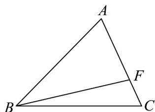
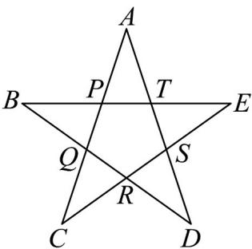

> [!faq]- 《专题20 平面向量精选压轴60题12类考点专练（高效培优期中专项训练）数学人教A版高一必修第二册_57404409》官方解析
>
> > [!success]- **【答案】** ( ) A.1 B.4 C.9 D.16
>
> > [!note]- **【分析】**
> > 由题意得 $3x + y = 1$ ，且 $x > 0, y > 0$ ，再利用基本不等式“1”的妙用求解即可.
>
> > [!note]- **【解析】**
> > 
> >
> > 由题意，在VABC中，点F为线段AC上任一点（不含端点），
> >
> > 若 $\overline{BF}=3\overline{BA}+\overline{yBC}$ ，则有x>0,y>0
> >
> > 设 $\overline{AF} = \lambda \overline{AC}$ ，则 $\overline{BF} = \overline{BA} + \overline{AF} = \overline{BA} + \lambda \left( \overline{BC} - \overline{BA} \right) = (1 - \lambda) \overline{BA} + \lambda \overline{BC}$
> >
> > 所以 $3x + y = 1 - \lambda +\lambda = 1$
> >
> > $$
> > \frac {3}{x} + \frac {1}{y} = \left(\frac {3}{x} + \frac {1}{y}\right) (3 x + y) = 9 + 1 + \frac {3 y}{x} + \frac {3 x}{y} \quad 1 0 + 2 \sqrt {\frac {3 y}{x} \cdot \frac {3 x}{y}} = 1 6
> > $$
> >
> > 当且仅当 $\frac{3y}{x} = \frac{3x}{y}$ ，即 $x = y = \frac{1}{4}$ 时，等号成立，故 $\frac{3}{x} + \frac{1}{y}$ 的最小值为 16。
> >
> > 故选：D.
> >
> > 10．正五角星是一个非常优美的几何图形，且与黄金分割有着紧密联系，在如图所示的五角星中，以
> >
> > $P, Q, R, S, T$ 为顶点的多边形为正五边形，且 $\overrightarrow{AT} = \frac{\sqrt{5} + 1}{2}\overrightarrow{TS}$ ，设 $ES - AP = \lambda BQ (\lambda \in \mathbf{R})$ ，则 $\lambda = (\quad)$
> >
> > 
> >
> > A. $\frac{\sqrt{5} + 1}{2}$ B. $\frac{\sqrt{5} - 1}{2}$ C. $\frac{\sqrt{5} + 1}{2}$ D. $\frac{1 - \sqrt{5}}{2}$
> >
> > 【答案】D
> >
> > 【分析】由平面向量的加减及线性运算即可求解.
> >
> > 【详解】由题意： $ES = RC, AP = QC$
> >
> > 则 $ES - AP = RC - QC = RC + CQ = RQ,$
> >
> > 因为 $\frac{\overrightarrow{A}T}{2}=\frac{\sqrt{5}+1\overrightarrow{TS}}{2}$ ，同样 $\overrightarrow{B}Q=\frac{\sqrt{5}+1\overrightarrow{QR}}{2}$
> >
> > 所以 $\frac{\overrightarrow{RQ}}{2}=\frac{2}{\sqrt{5}+1}\overrightarrow{QB}=\frac{\sqrt{5}-1}{2}\overrightarrow{QB}=-\frac{\sqrt{5}-1}{2}\overrightarrow{BQ}=\frac{1-\sqrt{5}}{2}\overrightarrow{BQ},$ 则 $\lambda=\frac{1-\sqrt{5}}{2}$
> >
> > 故选 **D**
