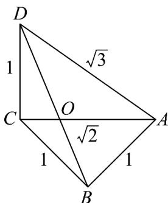

<!-- question-source:start -->
37. 如图是古希腊数学家特埃特图斯用来构造无理数 $\sqrt{2}, \sqrt{3}$ 的图形，图中四边形 $ABCD$ 的对角线相交于点 $O$ ，若 $DO = \lambda OB$ ，则 $\lambda = (\quad)$

A.1 B. $\sqrt{2}$ C. $\frac{\sqrt{6}}{2}$ D.5
<!-- question-source:end -->

![[高中/课堂同步/题库/人教A版高中数学同步讲义(2026)/02_必修第二册/期中专项训练+期中模拟卷/专题20 平面向量精选压轴60题12类考点专练（高效培优期中专项训练）数学人教A版高一必修第二册_57404409/题型八_由向量共线_求参数/questions/answers/Q00077425A1.md]]
