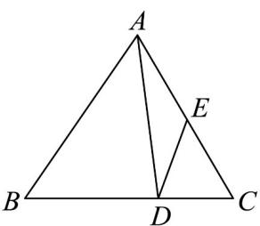
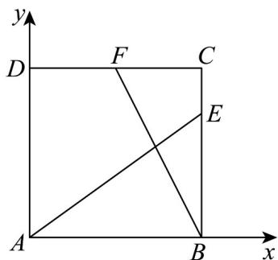

> [!faq]- 《专题20 平面向量精选压轴60题12类考点专练（高效培优期中专项训练）数学人教A版高一必修第二册_57404409》官方解析
>
> > [!success]- **【答案】** A．在VABC中， $\overline{BD}=2\overline{DC}$ ，E为AC的中点，则 $\overline{DE}=-\frac{1}{3}\overline{AB}-\frac{1}{6}\overline{AC}$ B．在中，与满足 $\left(\frac{\square\square\square}{AB}+\frac{\square\square\square}{AC}\right)\cdot\overrightarrow{BC}=0$ ，则是等腰三角形 C．已知 $a = (1, - 3)$ ， $b = (k,1)$ ，若 $^a$ 与 $^b$ 的夹角是钝角，则 $k < 3$ D．在边长为6的正方形ABCD中，点E在边BC上，且BE=2EC，点F是CD中点，则 $AE\cdot BF=6$
>
> > [!note]- **【分析】**
> > 对于 A，利用平面向量基本定理根据题意将 DE 用 AB, AC 表示出来再判断；对于 B，由向量的
> >
> > 加法法则判断；对于 C，由题意可知 $a \cdot b < 0$ ，且两向量不共线，从而可求出 k 的范围；对于 D，以 A 为
> >
> > 原点建立直角坐标，表示 $AE, BF$ ，然后利用数量积求解.
>
> > [!note]- **【解析】**
> > 
> >
> > 对于 A，因为 VABC 中， $BD = 2DC$ ，E 为 AC 的中点，
> >
> > 所以 $\overline{DE}=\overline{DC}+\overline{CE}=\frac{1}{3}\overline{BC}+\frac{1}{2}\overline{CA}=\frac{1}{3}\left(\overline{AC}-\overline{AB}\right)-\frac{1}{2}\overline{AC}=-\frac{1}{6}\overline{AC}-\frac{1}{3}\overline{AB}$ ，所以 A 正确；
> >
> > 对于 B，因为 $\overset{\cup\cup}{AB}$ 与 $\overset{\cup\cup\cup}{AC}$ 是非零向量，
> >
> > 所以 $|AB|+\frac{ABC}{|AC|}$ 所在的直线平分 $\angle BAC$
> >
> > 因为 $\left( \begin{array}{cc}\text{AB} & \text{AC}\\ \text{AB} + \text{AC} \end{array} \right)\cdot \text{BC} = 0$ ，所以 $\left( \begin{array}{cc}\text{AB} & \text{AC}\\ \text{AB} + \text{AC} \end{array} \right)\bot \text{BC}$
> >
> > 所以 VABC 是等腰三角形，所以 B 正确；
> >
> > 对于 C，因为 a 与 b 的夹角是钝角，
> >
> > 所以 $a \cdot b < 0$ ，且两向量不共线，
> >
> > 由 $a \cdot b < 0$ 得 $k - 3 < 0$ ，得 $k < 3$
> >
> > 当 $a$ 与 $b$ 共线时 $\frac{k}{1} = \frac{1}{-3}$ ，得 $k = -\frac{1}{3}$ ，
> >
> > 所以当 $a$ 与 $b$ 的夹角是钝角时 $k < 3$ 且 $k \neq -\frac{1}{3}$ ，所以C错误，
> >
> > 对于D，
> >
> > 
> >
> > 如图，以 A 为原点建立直角坐标，
> >
> > 则由题意可得 $A(0,0), B(6,0), E(6,4), F(3,6)$
> >
> > 所以 $\overline{AE} = (6, 4)$ , $\overline{BF} = (-3, 6)$
> >
> > 所以 $AE \cdot BF = -18 + 24 = 6$ ，所以 D 正确，
> >
> > 故选 **ABD**.
