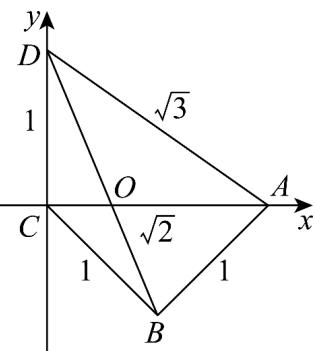

> [!faq]- 《专题20 平面向量精选压轴60题12类考点专练（高效培优期中专项训练）数学人教A版高一必修第二册_57404409》官方解析
>
> > [!success]- **【答案】** B
>
> > [!note]- **【分析】**
> > 根据已知构建合适的直角坐标系，标注相关点坐标，由向量共线的坐标表示列方程求参数值.
>
> > [!note]- **【解析】**
> > 因为 $AD^{2}=AC^{2}+CD^{2}$ ，所以 $AC\perp CD$ ，
> >
> > 以 $C$ 为坐标原点， $AC$ 所在直线为 $x$ 轴， $CD$ 所在直线为 $y$ 轴，建立平面直角坐标系，
> >
> > 
> >
> > 如图所示，则 $C(0,0),A(\sqrt{2},0),D(0,1),B(\frac{\sqrt{2}}{2}, - \frac{\sqrt{2}}{2})$
> >
> > 设 $O(b,0)$ ，则 $\overrightarrow{DO} = (b, - 1)$ ， $\overrightarrow{OB} = \left(\frac{\sqrt{2}}{2} -b, - \frac{\sqrt{2}}{2}\right)$
> >
> > 由 $\begin{array}{l}\text{由}\\ \text{DO} = \lambda \text{OB}\end{array}$ ，所以 $\left\{ \begin{array}{l}b = \lambda \left( \frac{\sqrt{2}}{2} -b\right)\\ -1 = -\frac{\sqrt{2}}{2}\lambda \end{array} \right.$ ，可得 $\left\{ \begin{array}{l}\lambda = \sqrt{2}\\ b = \sqrt{2} -1 \end{array} \right.$
> >
> > 故选 **B**
