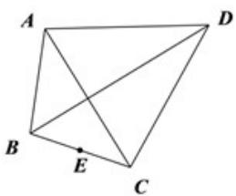

> [!faq]- 《专题20 平面向量精选压轴60题12类考点专练（高效培优期中专项训练）数学人教A版高一必修第二册_57404409》官方解析
>
> > [!success]- **【答案】** B
>
> > [!note]- **【解析】**
> > 分别讨论E点在每条边上运动时，向量点积的最小值，即可得到最小值.
> > 【详解】如图所示，
> >
> > 
> >
> > $$
> > A B C D
> > $$
> >
> > $$
> > B C, C D
> > $$
> >
> > $$
> > B C \perp C D
> > $$
> >
> > $$
> > \stackrel {\mathrm{uu}} {C B} \cdot \stackrel {\mathrm{uu}} {C D} = 0
> > $$
> > - **①**：当点 $E$ 在边 $BC$ 上运动时，设 $\overline{EB} = \lambda \overline{CB}(0 \leq \lambda \leq 1)$ ，则 $\overline{EC} = (\lambda - 1)CB$
> >
> > $$
> > E B \cdot E D = E B \cdot \left(E C + C D\right) = E B \cdot E C = \lambda C B \cdot (\lambda - 1) C B = 4 \lambda (\lambda - 1)
> > $$
> >
> > 当 $\lambda=\frac{1}{2}$ 时， $\overline{EB}\cdot\overline{ED}$ 的最小值为 -1；
> >
> > $$
> > C D
> > $$
> >
> > $$
> > \stackrel {\square \sqcup \sqcup} {E D} = k \stackrel {\square \sqcup \sqcup} {C D} (0 \leq k \leq 1)
> > $$
> >
> > $$
> > \stackrel \smash \smash \smash \smash \smash \smash \smash \smash \smash \smash \smash \smash \smash \smash \smash \smash \smash \smash \smash \smash \smash \smash \smash \smash \smash \smash \smash \smash \smash \smash \smash \smash \smash \smash\smash \smash \smash \smash \smash \smash \smash \smash \smash \smash \smash \smash {\smash {\smash {\smash {\smash {\smash {\smash {\smash {\smash {\smash {\smash {\smash {\smash {\smash {\smash {\smash {\smash {\smash {\smash {\smash {\smash {\smash {\sim}}}}}}}}}}}}}}}}}}}}}} {E C} = \left(k - 1\right) \stackrel \smash \smash \smash \smash \smash \smash \smash \smash {\smash {\smash {\smash {\smash {\smash {\smash {\smash {\smash {\smash {\smash {\smash {\smash {\smash {\smash {\smash {\smash {\smash {\smash {\smash {\smash {\smash {\smash {\smash {\smash {\sim}}}}}}}}}}}}}}}}}}}}}}} {C D}}}
> > $$
> >
> > $$
> > \stackrel {\text {UUU}} {E B} \cdot \stackrel {\text {UUU}} {E D} = \left(\stackrel {\text {UUU}} {E C} + \stackrel {\text {UUU}} {C B}\right) \cdot \stackrel {\text {UUU}} {E D} = \stackrel {\text {UUU}} {E C} \cdot \stackrel {\text {UUU}} {E D} = (k - 1) \stackrel {\text {UUU}} {C D} \cdot k \stackrel {\text {UUU}} {C D} = 1 2 k (k - 1)
> > $$
> >
> > 当 $k = \frac{1}{2}$ 时， $EB \cdot ED$ 的最小值为 -3；
> >
> > 综上， $\overline{EB} \cdot \overline{ED}$ 的最小值为 -3；
> >
> > 故选 **B**.
