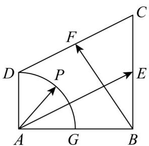
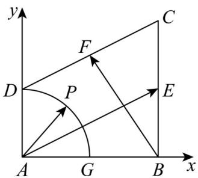

> [!faq]- 《专题20 平面向量精选压轴60题12类考点专练（高效培优期中专项训练）数学人教A版高一必修第二册_57404409》官方解析
>
> > [!success]- **【答案】**  A. $\left[\frac{1}{2},\frac{\sqrt{2}}{2}\right]$ B. $\left[\frac{1}{2},\sqrt{2}\right]$ C. $\left[\frac{\sqrt{2}}{2},\sqrt{2}\right]$ D. $[1,\sqrt{2} ]$
>
> > [!note]- **【分析】**
> > 建立空间直角坐标系，求得 $\overline{AP}=\left(\cos\alpha,\sin\alpha\right)$ ， $\overline{AE}=\left(2,1\right)$ ， $\overline{AB}=\left(2,0\right)$ ， $\overline{BF}=\left(-1,\frac{3}{2}\right)$ ，由
> >
> > $\overline{AP}=\lambda\overline{AE}+\mu\overline{BF}$ ，得到 $(\cos\alpha,\sin\alpha)=\lambda(2,1)+\mu(-1,\frac{3}{2})$ ， $\lambda,\mu$ 用 $\alpha$ 表示，利用辅助角公式化简，再利用
> >
> > 三角函数性质求解.
>
> > [!note]- **【解析】**
> > 建立如图所示直角坐标系：
> >
> > 
> >
> > $$
> > A (0, 0), B (2, 0), C (2, 2), D (0, 1), E (2, 1), F \left(1, \frac {3}{2}\right), P (\cos \alpha , \sin \alpha) \left(\alpha \in \left[ 0, \frac {\pi}{2} \right]\right)
> > $$
> >
> > 所以 $\overline{AP} = (\cos \alpha, \sin \alpha)$ ， $\overline{AE} = (2, 1)$ ， $\overline{AB} = (2, 0)$ ， $\overline{BF} = (-1, \frac{3}{2})$
> >
> > 因为 $AP = \lambda AE + \mu BF$
> >
> > 所以 $\left(\cos \alpha, \sin \alpha\right) = \lambda (2, 1) + \mu \left(-1, \frac{3}{2}\right)$
> >
> > 所以 $\cos \alpha = 2\lambda -\mu ,\sin \alpha = \lambda +\frac{3}{2}\mu$
> >
> > 解得 $\lambda=\frac{1}{4}\sin\alpha+\frac{3}{8}\cos\alpha,\mu=\frac{1}{2}\sin\alpha-\frac{1}{4}\cos\alpha$
> >
> > 所以 $3\lambda + \frac{\mu}{2} = \sin \alpha + \cos \alpha = \sqrt{2} \sin \left( \alpha + \frac{\pi}{4} \right)$
> >
> > 因为 $\alpha \in \left[0, \frac{\pi}{2}\right]$
> >
> > 所以 $\alpha +\frac{\pi}{4}\in \left[\frac{\pi}{4},\frac{3\pi}{4}\right]$
> >
> > 所以 $\sin \left(\alpha +\frac{\pi}{4}\right)\in \left[\frac{\sqrt{2}}{2},1\right]$
> >
> > 所以 $3\lambda + \frac{\mu}{2}$ 的取值范围是 $[1, \sqrt{2}]$ .
> >
> > 故选 **D**
