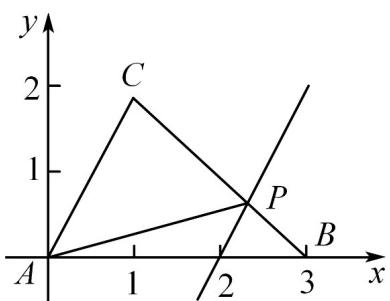

> [!faq]- 《专题20 平面向量精选压轴60题12类考点专练（高效培优期中专项训练）数学人教A版高一必修第二册_57404409》官方解析
>
> > [!success]- **【答案】** D
>
> > [!note]- **【分析】**
> > 以 A 为原点，以 AB 所在的直线为 x 轴，建立坐标系，设点 P 为 $(x,y)$ ，根据向量的坐标运算可得 $y=\sqrt{3}(x-2)$ ，当直线 $y=\sqrt{3}(x-2)$ 与直线 BC 相交时 $\left|\begin{matrix} & \square & \square \\ & AP & \end{matrix}\right|$ 最大，问题得以解决
>
> > [!note]- **【解析】**
> > 以 A 为原点，以 AB 所在的直线为 x 轴，建立如图所示的坐标系，
> > ∵ AB = 3, AC = 2, ∠BAC = 60°,
> > ∴ A(0,0), B(3,0), C(1, $\sqrt{3}$ ),
> >
> > 设点 $P$ 为 $(x,y)$ ， $0\leq x\leq 3$ ， $0\leq y\leq \sqrt{3}$
> >
> > $\because$ $AP = \frac{2}{3} AB + \lambda AC$
> >
> > $\therefore (x, y) = \frac{2}{3}(3, 0) + \lambda(1, \sqrt{3}) = (2 + \lambda, \sqrt{3}\lambda)$ , $\therefore \left\{ \begin{array}{l} x = 2 + \lambda \\ y = \sqrt{3}\lambda \end{array} \right.$ , $\therefore y = \sqrt{3}(x - 2)$ , ①
> >
> > 直线 BC 的方程为 $y = -\frac{\sqrt{3}}{2}(x - 3)$ ，②，
> >
> > 联立①②，解得 $\left\{ \begin{array}{l} x = \frac{7}{3} \\ y = \frac{\sqrt{3}}{3} \end{array} \right.$
> >
> > 此时 $|AP|$ 最大，
> >
> > $\therefore |AP| = \sqrt{\frac{49}{9} + \frac{1}{3}} = \frac{2\sqrt{13}}{3}$
> >
> > 故选：D.
> >
> > 
