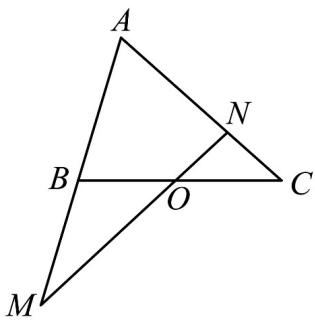
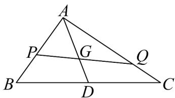

> [!faq]- 《专题20 平面向量精选压轴60题12类考点专练（高效培优期中专项训练）数学人教A版高一必修第二册_57404409》官方解析
>
> > [!success]- **【答案】** $AB = mAM$ , $AC = nAN$ ，则下列选项错误的是（）  A. $m + n = 2$ B. $mn\leq 1$ C. $m^2 +n^2$ 2 D. $\frac{1}{m} +\frac{1}{n}\leq 1$
>
> > [!note]- **【分析】**
> > 根据向量的共线定理可得 $m+n=2$ ，即可判断A，利用均值不等式判断BCD.
>
> > [!note]- **【解析】**
> > 由图可知 $m > 0, n > 0$
> >
> > 因为 $\overset{\square\square}{AO} = \frac{1}{2}\overset{\square\square}{AB} + \frac{1}{2}\overset{\square\square}{AC} = \frac{m}{2}\overset{\square\square\square}{AM} + \frac{n}{2}\overset{\square\square\square}{AN}$ ，且 M, O, N 三点共线，
> >
> > 所以 $\frac{m}{2} +\frac{n}{2} = 1$ ，即 $m + n = 2$ ，选项A正确；
> >
> > $mn \leq \left( \frac{m + n}{2} \right)^{2} = 1$ ，当且仅当 m = n = 1 时等号成立，B 正确；
> >
> > $m^2 + n^2 = (m + n)^2 - 2mn \frac{(m + n)^2}{2} = 2$ ，当且仅当 $m = n = 1$ 时等号成立，C 正确；
> >
> > $\frac{1}{m} + \frac{1}{n} = \frac{1}{2}(m + n)\left(\frac{1}{m} + \frac{1}{n}\right) = \frac{1}{2}\left(2 + \frac{n}{m} + \frac{m}{n}\right)\quad 2$ ，当且仅当 $\frac{n}{m} = \frac{m}{n}$ ，即 $m = n = 1$ 时等号成立，D 错误.
> >
> > 
