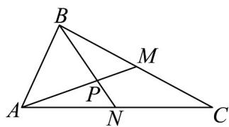

<!-- question-source:start -->
46. 如图，在VABC中，已知 $AB = 2$ ， $AC = 5$ ， $\angle BAC = 60^{\circ}$ ，BC，AC边上的两条中线AM，BN相交

于点 $P$ ：

(1)求中线 $AM$ 的长；

(2)求 $\angle MPN$ 的余弦值.

(3)设 $AP = tAM$ ，求 $t$ 的值，并用向量方法证明.
<!-- question-source:end -->

![[高中/课堂同步/题库/人教A版高中数学同步讲义(2026)/02_必修第二册/期中专项训练+期中模拟卷/专题20 平面向量精选压轴60题12类考点专练（高效培优期中专项训练）数学人教A版高一必修第二册_57404409/题型十_用基底表示向量求算问题/questions/answers/Q00077434A1.md]]
