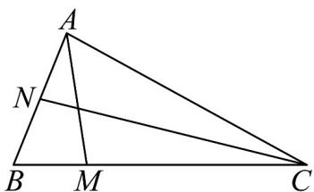

<!-- question-source:start -->
47. 已知在 $\mathrm{V}ABC$ 中， $N$ 为 $AB$ 中点， $\frac{BM}{3} = \frac{1}{3} MC$ ， $\left|AB\right| = 2$ ， $\left|\overline{AC}\right| = 4$ 。

(1)若 $\angle BAC = 60^{\circ}$ ，求 $AM$ 的长；

(2)设 $_{AB}^{uuu}$ 和 $_{AC}^{uuu}$ 的夹角为 $\theta$ ，若 $\cos\theta=\frac{1}{4}$ ，求 $\cos\angle ANC$ ；

(3)若线段 $NC$ 上一动点 $P$ 满足 $\overline{AP} = \frac{1}{2}\overline{AC} +\frac{1}{4}\overline{AB}$ ，试确定点 $P$ 的位置.
<!-- question-source:end -->

![[高中/课堂同步/题库/人教A版高中数学同步讲义(2026)/02_必修第二册/期中专项训练+期中模拟卷/专题20 平面向量精选压轴60题12类考点专练（高效培优期中专项训练）数学人教A版高一必修第二册_57404409/题型十_用基底表示向量求算问题/questions/answers/Q00077435A1.md]]
