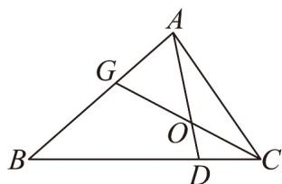
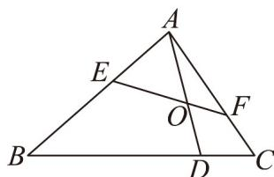

<!-- question-source:start -->
50．如图1所示，在VABC中，点D在线段BC上，满足 $3CD=DB$ ，G是线段AB上的点，线段CG与线

段 $AD$ 交于点 $O$ .

图1

图2

(1)若 $\overline{AD}=x\overline{AB}+y\overline{AC}$ ，求实数x,y的值；

(2)若 $3AG = 2GB$ ，且满足 $AO = tAD$

①求实数 $t$ 的值；

②如图2，过点 $O$ 的直线与边 $AB, AC$ 分别交于点 $E, F$ ，设 $\overline{AE} = \lambda \overline{AB}$ ， $\overline{AF} = \mu \overline{AC}$ ，（ $\lambda > 0$ ， $\mu > 0$ ），

求 $\lambda +\mu$ 的最小值.
<!-- question-source:end -->

![[高中/课堂同步/题库/人教A版高中数学同步讲义(2026)/02_必修第二册/期中专项训练+期中模拟卷/专题20 平面向量精选压轴60题12类考点专练（高效培优期中专项训练）数学人教A版高一必修第二册_57404409/题型十_用基底表示向量求算问题/questions/answers/Q00077438A1.md]]
