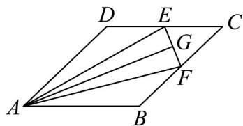

<!-- question-source:start -->
51. 如图， $E,F$ 分别是菱形ABCD的边 $CD$ 和 $BC$ 上的动点，且 $AB = 2,\angle DAB = 60^{\circ}$

(1)若 E, F 分别是 CD, BC 的中点，求 $EF \cdot AC$ ;

(2)若 E, F 分别是 CD, BC 的中点，G 是线段 EF 上的任意一点，求 $AG \cdot GB$ 的最大值；

(3)若 $E,F$ 分别为线段 $DC$ 和 $BC$ 上的动点，且 $DE = CF$ ，求 $\left|2AF + AE\right|$ 的取值范围.
<!-- question-source:end -->

![[高中/课堂同步/题库/人教A版高中数学同步讲义(2026)/02_必修第二册/期中专项训练+期中模拟卷/专题20 平面向量精选压轴60题12类考点专练（高效培优期中专项训练）数学人教A版高一必修第二册_57404409/题型十一_向量与几何最值问题/questions/answers/Q00077439A1.md]]
