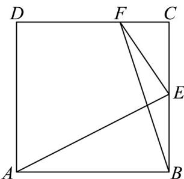
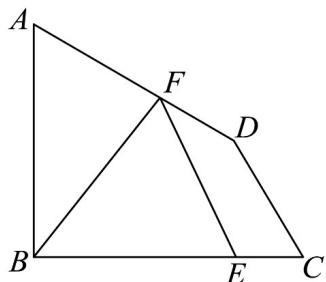

<!-- question-source:start -->
52. (1) $AB$ 为圆 $O$ 的一条弦，且 $\left|AB\right| = 2$ ，求 $AB \cdot AO$ 的值.

(2) 如图，正方形 $ABCD$ 的边长为 6，点 $E$ 是 $BC$ 边上的中点，点 $F$ 是边 $CD$ 上靠近 $C$ 的三等分点，求 $\overline{AE} \cdot EF$

(3) 如图，在平面四边形 $ABCD$ 中， $AB \perp BC$ ， $\angle BCD = 60^\circ$ ， $\angle ADC = 150^\circ$ ， $BE = 3EC$ ， $CD = \frac{2\sqrt{3}}{3}$ ， $BE = \sqrt{3}$ ，若点 $F$ 为边 $AD$ 的动点，求 $\overline{EF} \cdot \overline{BF}$ 的最小值

(4) 求数量积是向量中常见常考的问题，根据本题试总结常用的求数量积的方法.
<!-- question-source:end -->

![[高中/课堂同步/题库/人教A版高中数学同步讲义(2026)/02_必修第二册/期中专项训练+期中模拟卷/专题20 平面向量精选压轴60题12类考点专练（高效培优期中专项训练）数学人教A版高一必修第二册_57404409/题型十一_向量与几何最值问题/questions/answers/Q00077440A1.md]]
