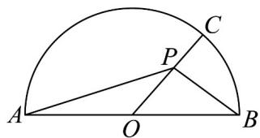

<!-- question-source:start -->
53．（1）已知向量 $e_{1},e_{2}$ 满足 $\left|e_{1}\right|=2\left|e_{2}\right|=2$ ，且 $e_{1}$ 与 $e_{2}$ 的夹角为 $\frac{\pi}{3}$ 。若 $e_{1}-2e_{2}$ 与 $\lambda e_{1}+e_{2}$ 的夹角为钝角，求实数 $\lambda$ 的取值范围；

(2) 已知向量 $a = (2, -2), b = (4, 5)$ ，求 $a$ 在 $b$ 上的投影向量的坐标；

(3) 如图，半圆的直径 $AB = 8, O$ 为圆心， $C$ 为半圆上不同于 $A, B$ 的任意一点，若 $P$ 为半径 $OC$ 上的动

点，求 $(PA + PB) \cdot PC$ 的最小值.

<!-- question-source:end -->

![[高中/课堂同步/题库/人教A版高中数学同步讲义(2026)/02_必修第二册/期中专项训练+期中模拟卷/专题20 平面向量精选压轴60题12类考点专练（高效培优期中专项训练）数学人教A版高一必修第二册_57404409/题型十一_向量与几何最值问题/questions/answers/Q00077441A1.md]]
