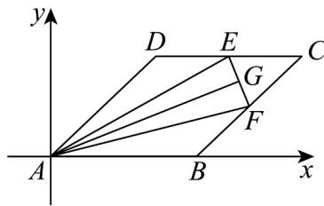

> [!faq]- 《专题20 平面向量精选压轴60题12类考点专练（高效培优期中专项训练）数学人教A版高一必修第二册_57404409》官方解析
>
> > [!success]- **【答案】** (1)0 (2)-2 (3) $\left[2\sqrt{13},2\sqrt{19}\right]$
>
> > [!note]- **【分析】**
> > （1）以点 $A$ 为原点建立平面直角坐标系，求出向量的坐标，即可求 $\overline{EF} \cdot \overline{AC}$
> >
> > (2) 设 $G(x,y)$ ，求出 $x=2+\frac{1}{2}\lambda, y=\sqrt{3}-\frac{\sqrt{3}}{2}\lambda$ ，，表示出 $AG \cdot GB$ ，利用二次函数的性质可得答案；
> >
> > (3) 设 $DE = t, t \in [0, 2]$ ，表示出 $\left| \overline{AE} + 2\overline{AF} \right|$ ，利用二次函数的性质可得答案.
>
> > [!note]- **【解析】**
> > （1）以点 $A$ 为原点建立平面直角坐标系，如图所示：则 $A(0,0), B(2,0)$
> >
> > $D(1,\sqrt{3}), C(3,\sqrt{3})$ ，由 E, F 分别是 CD, BC 的中点，
> >
> > $$
> > \therefore E (2, \sqrt {3}), F \left(\frac {5}{2}, \frac {\sqrt {3}}{2}\right), \therefore \overrightarrow {E F} = \left(\frac {1}{2}, \frac {- \sqrt {3}}{2}\right)
> > $$
> >
> > $$
> > \stackrel {\sqcup \sqcup} {A C} = (3, \sqrt {3}), \therefore E F \cdot A C = 0
> > $$
> >
> > 
> >
> > (2) 由 (1) 知，设 $G(x, y)$ ，则
> >
> > $$
> > \overrightarrow {E G} = \lambda \overrightarrow {E F} = \lambda \left(\frac {1}{2}, \frac {- \sqrt {3}}{2}\right) = \left(\frac {1}{2} \lambda , \frac {- \sqrt {3}}{2} \lambda\right) = (x - 2, y - \sqrt {3}), \therefore x = 2 + \frac {1}{2} \lambda , y = \sqrt {3} - \frac {\sqrt {3}}{2} \lambda ,
> > $$
> >
> > $$
> > \therefore G \left(2 + \frac {1}{2} \lambda , \sqrt {3} - \frac {\sqrt {3}}{2} \lambda\right), 0 \leq \lambda \leq 1, \therefore A G = \left(2 + \frac {1}{2} \lambda , \sqrt {3} - \frac {\sqrt {3}}{2} \lambda\right), G B = \left(- \frac {1}{2} \lambda , \frac {\sqrt {3}}{2} \lambda - \sqrt {3}\right),
> > $$
> >
> > $$
> > \therefore A G \cdot G B = \left(2 + \frac {1}{2} \lambda\right) \times \left(- \frac {1}{2} \lambda\right) + \left(\sqrt {3} - \frac {\sqrt {3}}{2} \lambda\right) \left(\frac {\sqrt {3}}{2} \lambda - \sqrt {3}\right) = - \lambda^ {2} + 2 \lambda - 3 = - (\lambda - 1) ^ {2} - 2 \cdot \text {当} _ {\lambda = 1} \text {时，} A G \cdot G B
> > $$
> >
> > 取得最大值为-2.
> >
> > (3) 设 $DE = t, t \in [0, 2]$ ，由 $DE = CF$ 得， $\therefore |AE + 2AF|^2 = 49 + (3\sqrt{3} - \sqrt{3}t)^2 = 3t^2 - 18t + 76 = 3(t - 3)^2 + 49$
> >
> > $$
> > E (1 + t, \sqrt {3}), F (3 - \frac {1}{2} t, \sqrt {3} - \frac {\sqrt {3}}{2} t) \therefore A E = (1 + t, \sqrt {3}), A F = (3 - \frac {t}{2}, \sqrt {3} - \frac {\sqrt {3}}{2} t) \therefore A E + 2 A F = (7, 3 \sqrt {3} - \sqrt {3} t)
> > $$
> >
> > t = 0
> > 时，
> >
> > $\left|\overline{AE} + 2\overline{AF}\right|$ 取得最大值为 $2\sqrt{19}$ ，当 $t = 2$ 时， $\left|\overline{AE} + 2\overline{AF}\right|$ 取得最小值为 $2\sqrt{13}, \therefore \left|\overline{AE} + 2\overline{AF}\right|$ 的范围为
> >
> > $$
> > \left[ 2 \sqrt {1 3}, 2 \sqrt {1 9} \right]
> > $$
