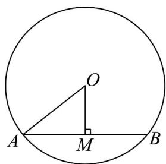
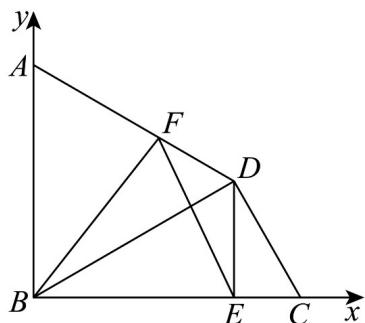

> [!faq]- 《专题20 平面向量精选压轴60题12类考点专练（高效培优期中专项训练）数学人教A版高一必修第二册_57404409》官方解析
>
> > [!success]- **【答案】** （1） $AB\cdot AO = 2$ ；（2） $AE\cdot EF = -3$ ；（3） $EF\cdot BF = \frac{15}{16}$ ；（4）答案见解析
>
> > [!note]- **【分析】**
> > （1）根据数量积的几何意义计算可得；
> >
> > (2) 选择基底向量，再根据数量积的定义及运算律计算，并利用函数的单调性可得最小值；
> >
> > (3) 建立平面直角坐标系，通过坐标运算求数量积；
> >
> > (4) 定义法，几何意义法，基底法，坐标法.
>
> > [!note]- **【解析】**
> > （1）取弦 AB 的中点 M，连接 OM，根据圆的垂径定理，可得 $OM \perp AB$ ，如图.
> >
> > 
> >
> > 因为 $\left|AB\right|=2$ ，所以 $\left|AM\right|=1$
> >
> > 根据向量数量积的几何意义：
> >
> > 得 $AB \cdot AO = AO \cdot AB = |AM| \cdot |AB| = 1 \times 2 = 2$
> >
> > (2) 因为 $AE = AB + BE = AB + \frac{1}{2}BC$ ， $EF = EC + CF = \frac{1}{2}BC + \frac{1}{3}CD = \frac{1}{2}BC - \frac{1}{3}AB$
> >
> > 因为正方形 $ABCD$ 的边长为 6，所以 $AB^2 = BC^2 = 6^2, AB \cdot BC = 0$
> >
> > 所以 $\overline{AE} \cdot \overline{EF} = \left( \frac{\overline{AB}}{2} + \frac{1}{2} \overline{BC} \right) \cdot \left( \frac{1}{2} \overline{BC} - \frac{1}{3} \overline{AB} \right) = -\frac{1}{3} AB^{2} + \frac{1}{4} BC^{2} + \frac{1}{3} AB \cdot BC$
> >
> > $$
> > = - \frac {1}{3} \times 6 ^ {2} + \frac {1}{4} \times 6 ^ {2} + 0 = - 1 2 + 9 = - 3.
> > $$
> >
> > 所以 $AE \cdot EF = -3$ .
> >
> > (3) 以 $B$ 为原点，以 $BC, BA$ 所在的直线为 $x, y$ 轴，建立如图所示的平面直角坐标系，
> >
> > 
> >
> > 依题意得 $CE = \frac{1}{3} BE = \frac{\sqrt{3}}{3}, BC = BE + CE = \frac{4\sqrt{3}}{3}, \angle BCD = 60^{\circ}$
> >
> > 又 $CD=\frac{2\sqrt{3}}{3}$
> >
> > 在 $\triangle BCD$ 中，由余弦定理得 $BD = \sqrt{\left(\frac{4\sqrt{3}}{3}\right)^2 + \left(\frac{2\sqrt{3}}{3}\right)^2 - 2\times\frac{4\sqrt{3}}{3}\times\frac{2\sqrt{3}}{3}\times\cos60^\circ} = \sqrt{\frac{16}{3} + \frac{4}{3} - \frac{8}{3}} = 2$
> >
> > 所以 $BD^{2} + CD^{2} = BC^{2}$ ，所以 $\angle BDC = 90^{\circ}$ ，故 $\angle DBC = 30^{\circ}$
> >
> > 在 $\triangle CDE$ 中，由余弦定理得 $DE = \sqrt{\left(\frac{\sqrt{3}}{3}\right)^2 + \left(\frac{2\sqrt{3}}{3}\right)^2 - 2\times\frac{\sqrt{3}}{3}\times\frac{2\sqrt{3}}{3}\cos60^\circ} = 1$
> >
> > 所以 $CE^{2} + DE^{2} = CD^{2}$ ，所以 $\angle DEC = 90^{\circ}$ ，
> >
> > 因为 $\angle ADC = 150^{\circ}$ ， $\angle BDC = 90^{\circ}$ ，故 $\angle ADB = 60^{\circ}$ ，
> >
> > 因为 $AB \perp BC$ ， $\angle DBC = 30^{\circ}$ ，所以 $\angle ABD = 60^{\circ}$ ，
> >
> > 所以在 $\triangle ABD$ 中， $\angle ABD = \angle ADB = 60^{\circ}$ ，所以 $\triangle ABD$ 为等边三角形，
> >
> > 所以 AB = BD = 2 ，所以 $A(0,2)$ , $D(\sqrt{3},1)$ , $E(\sqrt{3},0)$
> >
> > 设 $F(x,y)$ ，由点 $F$ 为边 $AD$ 的动点，设 $\overline{AF} = \lambda \overline{AD} (0 \leq \lambda \leq 1)$
> >
> > 即 $(x,y-2)=\lambda(\sqrt{3},-1)$ ，
> >
> > 解得 $x = \sqrt{3}\lambda, y = 2 - \lambda$ ，所以 $F(\sqrt{3}\lambda, 2 - \lambda)$ ，
> >
> > 所以 $EF \cdot BF = (\sqrt{3}\lambda - \sqrt{3}, 2 - \lambda) \cdot (\sqrt{3}\lambda, 2 - \lambda) = 4\lambda^{2} - 7\lambda + 4$
> >
> > 设 $f(\lambda) = 4\lambda^2 - 7\lambda + 4 = 4\left(\lambda - \frac{7}{8}\right)^2 + \frac{15}{16}(0 \leq \lambda \leq 1)$ ，可得其对称轴为 $\lambda = \frac{7}{8}$ ，且开口向上，
> >
> > 所以 $\lambda=\frac{7}{8}$ 时， $f(\lambda)$ 取得最小值 $\frac{15}{16}$ ，即 $\frac{\sqrt{EF}\cdot\sqrt{BF}}{EF}\cdot\frac{\sqrt{BF}}{BF}$ 的最小值为 $\frac{15}{16}$ .
> >
> > (4) 常用的求数量积的方法有以下 4 种方法：
> >
> > (1) 定义法：利用数量积的定义计算 $a \cdot b = |a| |b| \cos \theta$ ;
> >
> > (2) 几何意义法：根据数量积的几何意义计算：如第 (1) 的计算；
> >
> > (3) 基底法：选择适当的基底向量，再将向量用基底表示并进行数量积的运算；
> >
> > (4) 坐标法：建立适当的平面直角坐标系，再将向量用坐标表示，通过坐标运算求数量积.
