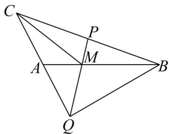

> [!faq]- 《专题20 平面向量精选压轴60题12类考点专练（高效培优期中专项训练）数学人教A版高一必修第二册_57404409》官方解析
>
> > [!success]- **【答案】** (1) $\frac{\sqrt{19}}{3}$ (2)-3
>
> > [!note]- **【分析】**
> > （1）用 $AB, AC$ 表示 $CM$ ，结合向量的模公式，即可求得本题答案；
> >
> > (2) 结合题目条件和向量积的公式，逐步化简，可得到 $7\lambda^2 + 2\lambda t - 4\lambda - t + 1 = 5\lambda - 1$ ，然后分离变量，利
> >
> > 用函数的单调性即可求得本题答案.
>
> > [!note]- **【解析】**
> > （1）因为 $t = -1$ 且 $\lambda = \frac{1}{2}$ ，所以 $A$ 是 $CQ$ 的中点， $P$ 是 $BC$ 的中点，则 $M$ 是 $\triangle CBQ$ 的重心，设 $AB = a$ ， $AC = b$
> >
> > 所以 $\overline{CM}=\frac{1}{3}\left(\overline{CB}+\overline{CQ}\right)=\frac{1}{3}\left(\overline{AB}-\overline{AC}-2\overline{AC}\right)=\frac{1}{3}\overline{AB}-\overline{AC}=\frac{1}{3}a-b$
> >
> > $$
> > \left| \stackrel {\text {   }} {\square} \stackrel {\text {   }} {\square} \stackrel {\text {   }} {\square} \right| = \sqrt {\left(\frac {1}{3} a - b\right) ^ {2}} = \sqrt {\frac {1}{9} a ^ {2} - \frac {2}{3} a \cdot b + b ^ {2}} = \sqrt {\frac {4}{9} + \frac {2}{3} + 1} = \frac {\sqrt {1 9}}{3};
> > $$
> >
> > 
> >
> > (2) 因为 $CP = \lambda CB (0 \leq \lambda \leq 1)$ ， $AQ = tb (t < 0)$
> >
> > 所以 $\overline{AP} = \overline{AC} + \overline{CP} = \overline{AC} + \lambda \overline{CB} = \lambda \overline{AB} + (1 - \lambda) \overline{AC} = \lambda a + (1 - \lambda)b$
> >
> > $$
> > \stackrel \smash \smash \smash \smash \smash \smash \smash \smash \smash \smash \smash \smash \smash \smash \smash \smash \smash \smash \smash \smash \smash \smash \smash \smash \smash \smash \smash \smash \smash \smash \smash \smash \smash \smash \smash \smash \smash \smash \smash \smash \smash \smash \smash \smash \smash \smash \smash \smash {\smash {\smash {\smash {\smash {\smash {\smash {\smash {\smash {\smash {\smash {\smash {\smash {\smash {\smash {\smash {\smash {\smash {\smash {\smash {\sim}}}}}}}}}}}}}}}}}}}} {P Q} = A Q - A P = t b - \left[ \lambda a + (1 - \lambda) b \right] = - \lambda a + (t + \lambda - 1) b
> > $$
> >
> > $$
> > A P \cdot A B = [ \lambda a + (1 - \lambda) b ] \cdot a = \lambda a ^ {2} + (1 - \lambda) b \cdot a = 5 \lambda - 1
> > $$
> >
> > $$
> > \stackrel {\sqcup \sqcup \sqcup} {P A} \cdot \stackrel {\sqcup \sqcup \sqcup} {P Q} = [ - \lambda a + (\lambda - 1) b ] \cdot [ - \lambda a + (t + \lambda - 1) b ] = 7 \lambda^ {2} + 2 \lambda t - 4 \lambda - t + 1
> > $$
> >
> > 由 $PA \cdot PQ + 3 = AP \cdot AB$ ，得： $7\lambda^{2} + 2\lambda t - 4\lambda - t + 1 = 5\lambda - 1$ ，
> >
> > 所以 $t(1-2\lambda)=7\lambda^{2}-9\lambda+5$ ，因为 $t<0,7\lambda^{2}-9\lambda+5>0$
> >
> > 所以 $\frac{1}{2} < \lambda \leq 1, t = \frac{7\lambda^2 - 9\lambda + 5}{1 - 2\lambda}$
> >
> > 令 $m = 1 - 2\lambda \in [-1,0)$ ，则 $t = \frac{\frac{7}{4}(1 - m)^2 - \frac{9}{2}(1 - m) + 5}{m} = \frac{7m}{4} +\frac{9}{4m} +1$ 在[-1,0)单调递减，所以当 $m = -1$ 时，
> >
> > 有最大值 - 3.
