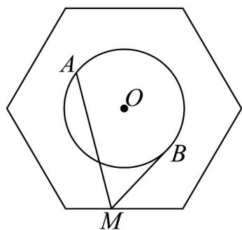

<!-- question-source:start -->
8. 如图，正六边形的边长为 $2\sqrt{3}$ ，半径为1的圆 $O$ 的圆心为正六边形的中心，若点 $M$ 在正六边形的边上

运动，动点 A、B 在圆 O 上运动且关于圆心 O 对称，则 $MA \cdot MB$ 的最大值为 \_\_\_\_

<!-- question-source:end -->

![[高中/课堂同步/题库/人教A版高中数学同步讲义(2026)/02_必修第二册/期中专项训练+期中模拟卷/专题20 平面向量精选压轴60题12类考点专练（高效培优期中专项训练）数学人教A版高一必修第二册_57404409/题型十二_用向量解决夹角问题/questions/answers/Q00077455A1.md]]
