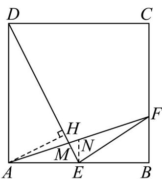

> [!faq]- 《专题20 平面向量精选压轴60题12类考点专练（高效培优期中专项训练）数学人教A版高一必修第二册_57404409》官方解析
>
> > [!success]- **【答案】** (1) $-\frac{1}{6}(2)-\frac{\sqrt{2}}{10}(3)\frac{DM}{ME}=6,\frac{AM}{MF}=\frac{3}{4}$
>
> > [!note]- **【分析】**
> > （1）根据平面向量的线性运算可得 $EF = -\frac{1}{2}BA + \frac{1}{3}BC$ ，进而求解；
> >
> > （2）如图，根据勾股定理和相似三角形的性质可得 $DM = \frac{6}{7} DE = \frac{3\sqrt{5}}{7} a, AM = \frac{6}{7} AN = \frac{\sqrt{10}}{7} a$ ，结合 $AD^{2} - DH^{2} = AH^{2} = AM^{2} - MH^{2}$ 建立方程，解得 $MH = \frac{\sqrt{5}}{35} a$ ，进而求解；
> >
> > (3) 由 (2)，根据 $\frac{AM}{MF} = \frac{AM}{AF - AM}$ 计算即可求解.
>
> > [!note]- **【解析】**
> > （1）由题意知， $EF=\overline{EB}+\overline{BF}=\frac{1}{2}\overline{AB}+\frac{1}{3}\overline{BC}=-\frac{1}{2}\overline{BA}+\frac{1}{3}\overline{BC}$
> >
> > 又 $EF = xBA + yBC$ ，所以 $x = -\frac{1}{2}, y = \frac{1}{3}$ ，故 $x + y = -\frac{1}{2} + \frac{1}{3} = -\frac{1}{6}$ ；
> >
> > (2) 如图，过点 E 作 EN // BC 交于 AF 于点 N，过 A 作 AH ⊥ DE 于点 H，
> >
> > 设正方形ABCD的边长为 $a$ ，则 $AE = BE = \frac{1}{2} a, BF = \frac{1}{3} a$
> >
> > 由 $EN // BC$ ，得 $EN // AD$ ， $EN = \frac{1}{2} BF = \frac{1}{6} a$ ，
> >
> > 所以 $DE = \sqrt{AD^{2} + AE^{2}} = \frac{\sqrt{5}}{2}a, AF = \sqrt{AB^{2} + BF^{2}} = \frac{\sqrt{10}}{3}a$
> >
> > 由 $\triangle AMD\sim \triangle NME$ ，得 $\frac{DM}{EM} = \frac{AM}{NM} = \frac{AD}{NE} = 6$
> >
> > 所以 $DM = \frac{6}{7} DE = \frac{3\sqrt{5}}{7} a, AM = \frac{6}{7} AN = \frac{\sqrt{10}}{7} a$
> >
> > 因为 $AH \perp DE$ ，所以 $AD^{2} - DH^{2} = AH^{2}, AM^{2} - MH^{2} = AH^{2}$
> >
> > 所以 $AD^2 - DH^2 = AM^2 - MH^2$ ，即 $a^2 - \left(\frac{3\sqrt{5}}{7} a - MH\right)^2 = \left(\frac{\sqrt{10}}{7} a\right)^2 - MH^2$
> >
> > 解得 $MH = \frac{\sqrt{5}}{35} a$
> >
> > 所以 $\cos\angle AME=-\cos\angle AMH=-\frac{MH}{AM}=-\frac{\frac{\sqrt{5}}{35}a}{\frac{\sqrt{10}}{7}a}=-\frac{\sqrt{2}}{10}$
> >
> > (3) 由 (2) 知， $\triangle AMD \sim \triangle NME$ ，得 $\frac{DM}{EM} = \frac{AM}{NM} = \frac{AD}{NE} = 6$
> >
> > $$
> > \text {故} \frac {D M}{E M} = 6, \frac {A M}{M F} = \frac {A M}{A F - A M} = \frac {\frac {\sqrt {1 0}}{7} a}{\frac {\sqrt {1 0}}{3} a - \frac {\sqrt {1 0}}{7} a} = \frac {3}{4}.
> > $$
> >
> > 
