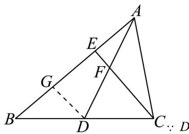

> [!faq]- 《专题20 平面向量精选压轴60题12类考点专练（高效培优期中专项训练）数学人教A版高一必修第二册_57404409》官方解析
>
> > [!success]- **【答案】** (1) $CE=\sqrt{3},AD=\frac{\sqrt{19}}{2}$ (2) $\frac{\sqrt{57}}{19}$
>
> > [!note]- **【分析】**
> > （1）利用三角函数定义即可求得 CE 的长；利用向量法即可求得 AD 的长度；
> >
> > (2) 利用向量夹角的余弦公式即可求得 $\cos\angle CFD$ 的值.
>
> > [!note]- **【解析】**
> > （1）∵ CE 是高，∴ $\angle AEC = \frac{\pi}{2}$ ，在 $Rt_{\triangle AEC}$ 中，AC = 2, $\angle EAC = \frac{\pi}{3}$ ，
> >
> > 所以 $CE = AC \sin \angle EAC = 2 \sin \frac{\pi}{3} = \sqrt{3}$
> >
> > ∵ AD 是中线，∴ $\overline{AD} = \frac{1}{2} \left( \overline{AB} + \overline{AC} \right)$
> >
> > $$
> > \therefore A D ^ {2} = \left[ \frac {1}{2} \left(A B + A C\right) \right] ^ {2} = \frac {1}{4} \left(A B ^ {2} + 2 A B \cdot A C + A C ^ {2}\right)
> > $$
> >
> > $$
> > = \frac {1}{4} \left(3 ^ {2} + 2 \times 3 \times 2 \cos \frac {\pi}{3} + 2 ^ {2}\right) = \frac {1 9}{4}, \therefore A D = \frac {\sqrt {1 9}}{2}
> > $$
> >
> > $$
> > \therefore C E = \sqrt {3}, A D = \frac {\sqrt {1 9}}{2}
> > $$
> >
> > (2) $\because AE = AC \cdot \cos \frac{\pi}{3} = 1 = \frac{1}{3} AB, \therefore AE = \frac{1}{3} AB$ ,
> >
> > ∴ $EC = AC - AE = AC - \frac{1}{3} AB$
> >
> > $$
> > \therefore A D \cdot E C = \frac {1}{2} \left(A B + A C\right) \cdot \left(A C - \frac {1}{3} A B\right)
> > $$
> >
> > $$
> > = \frac {1}{2} \left(A C ^ {2} + \frac {2}{3} A B \cdot A C - \frac {1}{3} A B ^ {2}\right) = \frac {1}{2} \left(2 ^ {2} + \frac {2}{3} \times 3 \times 2 \cos \frac {\pi}{3} - \frac {1}{3} \times 3 ^ {2}\right) = \frac {3}{2}
> > $$
> >
> > $$
> > \therefore \cos \angle C F D = \cos \left\langle \overrightarrow {A D}, \overrightarrow {E C} \right\rangle = \frac {\overrightarrow {A D} \cdot \overrightarrow {E G}}{\left| A D \right| \cdot \left| E C \right|} = \frac {\frac {3}{2}}{\frac {\sqrt {1 9}}{2} \times \sqrt {3}} = \frac {\sqrt {5 7}}{1 9}.
> > $$
> >
> > 另解：过 $D$ 作 $DG \parallel CE$ 交 $BE$ 于 $G$
> >
> > 
> >
> > 是 的中点， 是 的中点，
> >
> > ∴ AE = EG = GB = 1, EF 是 $\triangle AGD$ 的中位线，DG 是 $\triangle BCE$ 的中位线，
> >
> > $$
> > \therefore E F = \frac {1}{2} G D = \frac {1}{4} C E = \frac {\sqrt {3}}{4}, A F = \frac {1}{2} A D = \frac {\sqrt {1 9}}{4}
> > $$
> >
> > $$
> > \cos \angle C F D = \cos \angle A F E = \frac {E F}{A F} = \frac {\frac {\sqrt {3}}{4}}{\frac {\sqrt {1 9}}{4}} = \frac {\sqrt {5 7}}{1 9}.
> > $$
