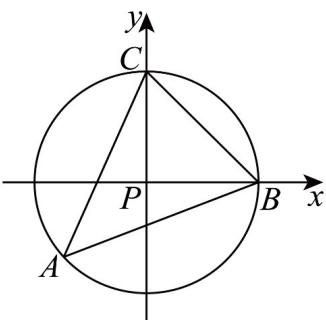

> [!faq]- 《专题20 平面向量精选压轴60题12类考点专练（高效培优期中专项训练）数学人教A版高一必修第二册_57404409》官方解析
>
> > [!success]- **【答案】** C
>
> > [!note]- **【分析】**
> > 先由条件可得 $\angle BPC = \frac{\pi}{2}$ ，再建立平面直角坐标系得 $\lambda^2 + \mu^2 = 1$ ，再进一步判断点 $A$ 在优弧 $BC$ 上， $\overline{PA}$ 落在角 $\theta \in (\frac{\pi}{2}, 2\pi)$ 的终边上，再用三角函数来解决取值范围问题。
>
> > [!note]- **【解析】**
> > 由 $\left|PA\right|=\left|PB\right|=\left|PC\right|$ ，所以点P为VABC的外心，又因为 $\angle A=\frac{\pi}{4}$ ，所以 $\angle BPC=2\times\frac{\pi}{4}=\frac{\pi}{2}$
> >
> > 设 $\left| \overline{PA} \right| = \left| \overline{PB} \right| = \left| \overline{PC} \right| = r$ ，再以点P为原点，分别以PB,PC所在直线为x,y轴建立平面直角坐标系，如图：
> >
> > 
> >
> > 则 $B(r,0),C(0,r),\overline{PB} = (r,0),\overline{PC} = (0,r)$ ，所以 $\overline{PA} = \lambda \overline{PB} +\mu \overline{PC} = (\lambda r,0) + (0,\mu r) = (\lambda r,\mu r)$
> >
> > 又因为 $\left|PA\right| = r$ ，所以 $(\lambda r)^2 + (\mu r)^2 = r^2$ ，即 $\lambda^2 + \mu^2 = 1$
> >
> > 又因为 $\angle A = \frac{\pi}{4}$ ，所以点 $A$ 在优弧 $BC$ 上，所以 $\frac{1}{PA}$ 落在角 $\theta \in (\frac{\pi}{2}, 2\pi)$ 的终边上，
> >
> > 由三角函数的定义有 $\lambda r = r\cos \theta, \mu r = r\sin \theta$ ，即 $\lambda = \cos \theta, \mu = \sin \theta$
> >
> > 所以 $\lambda +\mu = \cos \theta +\sin \theta = \sqrt{2}\sin (\theta +\frac{\pi}{4})$ ，又因为 $\theta \in (\frac{\pi}{2},2\pi)$ ，所以 $\theta +\frac{\pi}{4}\in (\frac{3\pi}{4},\frac{9\pi}{4})$
> >
> > $\sin (\theta +\frac{\pi}{4})\in [-1,\frac{\sqrt{2}}{2}),\sqrt{2}\sin (\theta +\frac{\pi}{4})\in [-\sqrt{2},1)$ 所以 $\lambda +\mu \in [-\sqrt{2},1)$
> >
> > 故选 **C**
