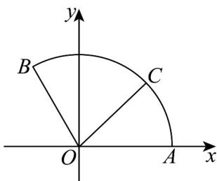

> [!faq]- 《专题20 平面向量精选压轴60题12类考点专练（高效培优期中专项训练）数学人教A版高一必修第二册_57404409》官方解析
>
> > [!success]- **【答案】** A. 当 $C$ 位于 $A$ 点时， $x + y$ 的值最小 B. $x + y$ 的值最大为 2 C. $\overline{CA} \cdot \overline{CB}$ 的取值范围为 $\left(-\frac{1}{2}, 0\right)$ D. $OC \cdot BA$ 的取值范围为 $\left[-\frac{3}{2}, \frac{3}{2}\right]$
>
> > [!note]- **【分析】**
> > 建立坐标系，得出点的坐标，进而可得向量的坐标，化已知问题为三角函数的最值可判断结合
> >
> > 选项逐一求解.
>
> > [!note]- **【解析】**
> > 以 O 为原点，OA 所在直线为 x 轴，建立如图平面直角坐标系.
> >
> > 
> >
> > 则 $A(1,0)$ ， $B\left(-\frac{1}{2},\frac{\sqrt{3}}{2}\right)$
> >
> > 设 $\angle AOC = \theta$ ，则 $\theta \in \left[0, \frac{2\pi}{3}\right]$ ，且 $C(\cos \theta, \sin \theta)$ .
> >
> > $$
> > \underset {O C} {\square \square \square} = x O A + y O B \Rightarrow (\cos \theta , \sin \theta) = x (1, 0) + y \left(- \frac {1}{2}, \frac {\sqrt {3}}{2}\right)
> > $$
> >
> > 所以 $\left\{\begin{aligned}x&=\cos\theta+\frac{\sqrt{3}}{3}\sin\theta\\ y&=\frac{2\sqrt{3}}{3}\sin\theta\end{aligned}\right.$
> >
> > 所以 $x + y = \cos\theta + \sqrt{3}\sin\theta = 2\sin\left(\theta + \frac{\pi}{6}\right)$ ， $\theta \in \left[0, \frac{2\pi}{3}\right]$ .
> >
> > 因为 $\theta +\frac{\pi}{6}\in \left[\frac{\pi}{6},\frac{5\pi}{6}\right]$ ，所以 $\sin \left(\theta +\frac{\pi}{6}\right)\in \left[\frac{1}{2},1\right],x + y\in [1,2].$
> >
> > 当 $\theta +\frac{\pi}{6} = \frac{\pi}{6}$ 或 $\theta +\frac{\pi}{6} = \frac{5\pi}{6}$ ，即 $\theta = 0$ 或 $\theta = \frac{2\pi}{3}$ 时， $x + y = 1$ 取得最小值，此时点 $C$ 与 $A$ 或 $B$ 重合；
> > 当 $\theta +\frac{\pi}{6} = \frac{\pi}{2}$ ，即 $\theta = \frac{\pi}{3}$ 时， $x + y = 2$ 取得最大值，此时点 $C$ 为 $\square_{AB}$ 的中点.
> >
> > 故 AB 正确；
> >
> > 对 C : $\overrightarrow{CA} = (1 - \cos\theta, -\sin\theta)$ , $\overrightarrow{CB} = \left(-\frac{1}{2} - \cos\theta, \frac{\sqrt{3}}{2} - \sin\theta\right)$ ,
> >
> > $$
> > C A \cdot C B = (1 - \cos \theta , - \sin \theta) \cdot \left(- \frac {1}{2} - \cos \theta , \frac {\sqrt {3}}{2} - \sin \theta\right) = (1 - \cos \theta) \left(- \frac {1}{2} - \cos \theta\right) + (- \sin \theta) \left(\frac {\sqrt {3}}{2} - \sin \theta\right)
> > $$
> >
> > $$
> > = \frac {1}{2} - \frac {1}{2} \cos \theta - \frac {\sqrt {3}}{2} \sin \theta = \frac {1}{2} - \sin \left(\theta + \frac {\pi}{6}\right)
> > $$
> >
> > 因为 $\sin\left(\theta+\frac{\pi}{6}\right)\in\left[\frac{1}{2},1\right]$ ，所以 $\overline{CA}\cdot\overline{CB}\in\left[-\frac{1}{2},0\right]$ ，故 C 错误；
> >
> > 对 D : $OC = (\cos \theta, \sin \theta)$ , $\overrightarrow{BA} = \left( \frac{3}{2}, -\frac{\sqrt{3}}{2} \right)$
> >
> > 所以 $\overrightarrow{OC}\cdot\overrightarrow{BA}=\left(\cos\theta,\sin\theta\right)\cdot\left(\frac{3}{2},-\frac{\sqrt{3}}{2}\right)=\frac{3}{2}\cos\theta-\frac{\sqrt{3}}{2}\sin\theta=\sqrt{3}\cos\left(\theta+\frac{\pi}{6}\right)$
> >
> > 因为 $\theta +\frac{\pi}{6}\in \left[\frac{\pi}{6},\frac{5\pi}{6}\right]$ ，所以 $\cos \left(\theta +\frac{\pi}{6}\right)\in \left[-\frac{\sqrt{3}}{2},\frac{\sqrt{3}}{2}\right]$ ，所以 $\sqrt{3}\cos \left(\theta +\frac{\pi}{6}\right)\in \left[-\frac{3}{2},\frac{3}{2}\right]$ ，故D正确.
