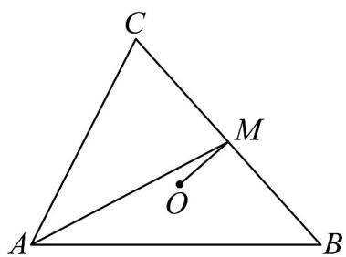

> [!faq]- 《专题20 平面向量精选压轴60题12类考点专练（高效培优期中专项训练）数学人教A版高一必修第二册_57404409》官方解析
>
> > [!success]- **【答案】** $\left[-\frac{1}{4},2\right)$
>
> > [!note]- **【分析】**
> > 结合外心的性质和向量线性运算可得 $\left|AB\right|^{2}=2\left|AC\right|-\left|AC\right|^{2}$ ，再代入原式可得
> >
> > $BC \cdot AO = |AC|^{2} - |AC|$ ，利用二次函数性质求解即可.
>
> > [!note]- **【解析】**
> > 如图所示，
> >
> > 由题知 O 是 VABC 的外心，取 BC 中点 M ，连接 OM ，
> >
> > 可得 $OM \perp BC$ ，故 $OM \cdot BC = 0$ 。
> >
> > 因为 $AO = AM + MO$
> >
> > 所以 $BC \cdot AO = BC \cdot (AM + MO) = BC \cdot AM + BC \cdot MO = BC \cdot AM$
> >
> > 由 $AM$ 是 $\mathrm{V}ABC$ 的中线，可得 $\overline{AM} = \frac{1}{2} (AB + AC)$ ，且 $\overline{BC} = \overline{AC} - AB$
> >
> > 故 $\overset{\square\square\square}{BC} \cdot \overset{\square\square\square}{AM} = \frac{1}{2} (\overset{\square\square\square}{AC} - \overset{\square\square\square}{AB}) \cdot (\overset{\square\square\square}{AC} + \overset{\square\square\square}{AB}) = \frac{1}{2} \left( \left| \overset{\square\square\square}{AC} \right|^2 - \left| \overset{\square\square\square}{AB} \right|^2 \right) = \frac{1}{2} \left( \left| AC \right|^2 - \left| AB \right|^2 \right)$ .
> >
> > 已知 $\left|AC\right|^{2}-2\left|AC\right|+\left|AB\right|^{2}=0$ ，可得： $\left|AB\right|^{2}=2\left|AC\right|-\left|AC\right|^{2}$
> >
> > 由 $\left|AB\right|^{2}>0,\left|AC\right|>0$ ，可得 $2\left|AC\right|-\left|AC\right|^{2}>0\Rightarrow0<\left|AC\right|<2$
> >
> > 将 $\left|AB\right|^{2}=2\left|AC\right|-\left|AC\right|^{2}$ 代入目标式：
> >
> > $$
> > B C \cdot A O = \frac {1}{2} \left(\left| A C \right| ^ {2} - \left| A B \right| ^ {2}\right) = \frac {1}{2} \left[ \left| A C \right| ^ {2} - \left(2 \left| A C \right| - \left| A C \right| ^ {2}\right) \right] = \left| A C \right| ^ {2} - \left| A C \right|,
> > $$
> >
> > 设 $y = \left|AC\right|^{2} - \left|AC\right|$ ，则 $y = \left(\left|AC\right| - \frac{1}{2}\right)^{2} - \frac{1}{4}$ ，
> >
> > $y$ 为开口向上的二次函数，对称轴为 $\left|AC\right| = \frac{1}{2}$ ， $\left|AC\right|\in (0,2)$
> >
> > 当 $\left|AC\right|=\frac{1}{2}$ 时，y取最小值 $-\frac{1}{4}$ （此时 $\left|AB\right|^{2}=\frac{3}{4}>0$ ，三角形存在，最小值可取）；
> >
> > 当 $|AC|\rightarrow2$ 时， $y\rightarrow2^{2}-2=2$ ，但 $|AC|<2$ ，故y<2。
> >
> > 因此 $BC \cdot AO$ 的取值范围是 $\left[-\frac{1}{4}, 2\right)$ .
> >
> > 
