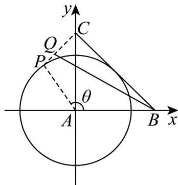

> [!faq]- 《专题20 平面向量精选压轴60题12类考点专练（高效培优期中专项训练）数学人教A版高一必修第二册_57404409》官方解析
>
> > [!success]- **【答案】** $\frac{2(\sqrt{5} - 1)}{3}$
>
> > [!note]- **【分析】**
> > 以 A 为原点建立平面直角坐标系，设 $P(\cos\theta,\sin\theta)$ ，根据题意得到 $\overline{BQ}$ 的坐标，利用参数方程求出 $\left|\overline{BQ}\right|$ 的最小值即可.
>
> > [!note]- **【解析】**
> > 
> >
> > 如图所示，以等腰直角三角形 $\triangle ABC$ 的顶点 $A$ 为原点建立平面直角坐标系， $AB$ 在 $x$ 轴， $AC$ 在 $y$ 轴，则由 $\angle A = 90^{\circ}$ 且 $BC = 2$ 得 $AB = AC = \sqrt{2}$ ，因此 $B(\sqrt{2}, 0), C(0, \sqrt{2})$
> >
> > 点 $P$ 在以 $A$ 为圆心的单位圆上，设 $P(\cos \theta, \sin \theta), \theta \in [0, 2\pi)$
> >
> > 根据向量关系 $\overrightarrow{AQ}=\frac{2}{3}\overrightarrow{AP}+\frac{1}{3}\overrightarrow{AC}$ 可得 $Q\left(\frac{2}{3}\cos\theta,\frac{2}{3}\sin\theta+\frac{\sqrt{2}}{3}\right)$ ，则 $\overrightarrow{BQ}=\left(\frac{2}{3}\cos\theta-\sqrt{2},\frac{2}{3}\sin\theta+\frac{\sqrt{2}}{3}\right)$
> >
> > 因此 $\left|BQ\right|^{2}=\left(\frac{2}{3}\cos\theta-\sqrt{2}\right)^{2}+\left(\frac{2}{3}\sin\theta+\frac{\sqrt{2}}{3}\right)^{2}$ ，化简得 $\left|BQ\right|^{2}=\frac{8}{3}+\frac{4\sqrt{2}}{9}\left(\sin\theta-3\cos\theta\right)$
> >
> > 而要使 $\left|BQ\right|$ 最小，需要 $\left|BQ\right|^{2}$ 最小，也就是 $\sin\theta-3\cos\theta$ 最小，
> >
> > 利用辅助角公式得 $\sin \theta - 3\cos \theta = \sqrt{10}\sin (\theta + \varphi)$ ，其中 $\tan \varphi = -3, \varphi \in \left(\frac{\pi}{2}, \pi\right)$ ，则 $(\sin \theta - 3\cos \theta)_{\min} = -\sqrt{10}$
> >
> > $$
> > \text {因此} \left| B Q \right| _ {\min} = \sqrt {\frac {8}{3} + \frac {4 \sqrt {2}}{9} \times (- \sqrt {1 0})} = \sqrt {\frac {8}{9} (3 - \sqrt {5})} = \frac {2 \sqrt {2}}{3} \sqrt {3 - \sqrt {5}}, \text {而} \sqrt {3 - \sqrt {5}} = \sqrt {\frac {5}{2}} - \sqrt {\frac {1}{2}}
> > $$
> >
> > 代入并化简得 $\left|BQ\right|_{\min}=\frac{2(\sqrt{5}-1)}{3}$
