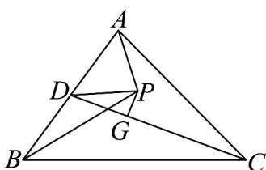

> [!faq]- 《专题20 平面向量精选压轴60题12类考点专练（高效培优期中专项训练）数学人教A版高一必修第二册_57404409》官方解析
>
> > [!success]- **【答案】** ABD
>
> > [!note]- **【分析】**
> > 对A，取 $AB$ 的中点 $D$ ，根据重心的性质化简判断即可；对B，根据垂心的性质推导可得
> >
> > $HA \cdot HC = HA \cdot HB = HC \cdot HB$ ，再设 $HA \cdot HC = HA \cdot HB = HC \cdot HB = x$ ，根据 3HB = -2HA - 4HC 可得
> >
> > $\left|\overrightarrow{HA}\right| = \sqrt{-\frac{7}{2}x}$ ，同理可得 $\left|\overrightarrow{HB}\right| = \sqrt{-2x}$ ，再根据向量的夹角公式求解即可；对C，化简可得
> >
> > $3OB + 2OC = -4OA$ ，再两边平方化简即可；对 D，根据条件推导 $AI \cdot BC = 0$ 即可。
>
> > [!note]- **【解析】**
> > 对 A，取 AB 的中点 D，因为 G 是 VABC 的重心，有 $2GD = CG$
> >
> > 所以， $2\left(\overline{PD}-\overline{PG}\right)=\overline{PG}-\overline{PC}$ ，即 $2\overline{PD}+\overline{PC}=3\overline{PG}$
> >
> > 又因为 $PA + PB = 2PD$ ，所以 $PA + PB + PC = 3PG$ ，故 A 正确；
> >
> > 
> >
> > 对 B，因为 H 为 VABC 的垂心，则 $AH \perp BC$ ，即 $AH \cdot BC = 0$
> >
> > 即 $\stackrel{\mathrm{uuu}}{AH}\cdot\left(\stackrel{\mathrm{uuu}}{HC}-\stackrel{\mathrm{uuu}}{HB}\right)=\stackrel{\mathrm{uuu}}{AH}\cdot\stackrel{\mathrm{uuu}}{HC}-\stackrel{\mathrm{uuu}}{AH}\cdot\stackrel{\mathrm{uuu}}{HB}=0$ ，则 $HA\cdot HC=HA\cdot HB$
> >
> > 同理， $HA \cdot HC = HC \cdot HB$ ，所以 $HA \cdot HC = HA \cdot HB = HC \cdot HB$
> >
> > 设 $HA \cdot HC = HA \cdot HB = HC \cdot HB = x$
> >
> > 因为 $2HA + 3HB + 4HC = 0$ ，所以 $2HA = -4HC - 3HB$
> >
> > 即 $2HA^{2} = -4HC \cdot HA - 3HB \cdot HA = -7x$ ，则 $x < 0$ ，所以 $\left|\overrightarrow{HA}\right| = \sqrt{-\frac{7}{2}x}$
> >
> > 因为 $3HB = -2HA - 4HC$ ，所以 $3HB^{2} = -2HA \cdot HB - 4HC \cdot HB = -6x$ ，
> >
> > 所以 $\left|\overrightarrow{HB}\right|=\sqrt{-2x}$ ，则 $\cos\angle AHB=\cos\left\langle\overrightarrow{HA},\overrightarrow{HB}\right\rangle=\frac{\overrightarrow{HA}\cdot\overrightarrow{HB}}{\left|\overrightarrow{HA}\right|\left|\overrightarrow{HB}\right|}$
> >
> > $= \frac{x}{\sqrt{-\frac{7}{2}x}\cdot\sqrt{-2x}} = \frac{x}{\sqrt{7}|x|} = -\frac{\sqrt{7}}{7}$ ，故B正确；
> >
> > 对 C，若 $\left|OA\right|=\left|OB\right|=\left|OC\right|=1$ 且 $4OA+3OB+2OC=0$ ，则 $3OB+2OC=-4OA$
> >
> > 两边同时平方可得： $9OB^{2}+4OC^{2}+12OB\cdot OC=16OA^{2}$
> >
> > 所以 $13 + 12OB \cdot OC = 16$ ，即 $OB \cdot OC = \frac{1}{4}$ ，故C错误；
> >
> > 对 D，因为 为 的内心， $\overrightarrow{AI}=\lambda\left(\frac{\overrightarrow{AB}}{|AB|\cos B}+\frac{\overrightarrow{AC}}{|AC|\cos C}\right)(\lambda\in\mathbf{R})$
> >
> > 故 $\overrightarrow{AI} \cdot \overrightarrow{BC} = \lambda \left( \frac{\overrightarrow{AB}}{|AB| \cos B} + \frac{\overrightarrow{AC}}{|AC| \cos C} \right) \cdot \overrightarrow{BC} = \lambda \left( \frac{\overrightarrow{AB} \cdot BC}{|AB| \cos B} + \frac{\overrightarrow{AC} \cdot BC}{|AC| \cos C} \right)$
> >
> > $= \lambda \left(-\left|\overline{B} C\right| + \left|\overline{B} C\right|\right) = 0$ ，即 $AI\perp \overline{BC}$
> >
> > 故点 $I$ 的轨迹为垂直于 $BC$ 的直线，又 $AI$ 平分 $\angle BAC$ ，因此 $AI$ 是 $BC$ 的中垂线，
> >
> > VABC 是以 BC 为底边的等腰三角形，故 D 正确。
