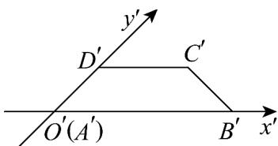

<!-- question-source:start -->
3．如图，四边形ABCD的斜二测画法的直观图为等腰梯形 $A^{\prime}B^{\prime}C^{\prime}D^{\prime}$ ，已知 $A^{\prime}B^{\prime} = 4$ ， $C^{\prime}D^{\prime} = 2$ ，则下列说

法正确的是（）

A. $A^{\prime}D^{\prime} = 2\sqrt{2}$ B. $AB = 4$

C．四边形ABCD的面积为 $6\sqrt{2}$ D．四边形ABCD的周长为 $6+\sqrt{6}+\sqrt{2}$
<!-- question-source:end -->

![[高中/课堂同步/题库/人教A版高中数学同步讲义(2026)/02_必修第二册/期中专项训练+期中模拟卷/专题21 立体几何初步及复数精选压轴60题12类考点专练（高效培优期中专项训练）数学人教A版高一必修第二册_57404446/题型一_斜二测画法当中有关量的计算/questions/answers/Q00077460A1.md]]
