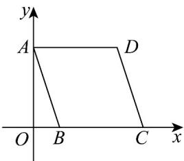

> [!faq]- 《专题21 立体几何初步及复数精选压轴60题12类考点专练（高效培优期中专项训练）数学人教A版高一必修第二册_57404446》官方解析
>
> > [!success]- **【答案】**  A.2 B. $2\sqrt{2}$ C.4 D.6
>
> > [!note]- **【解析】**
> > 将直观图还原为原图，如图，
> >
> > 
> >
> > 在直观图中， $O'B' = A'B' = 2$ ，则 $O'A' = 2\sqrt{2}$
> >
> > 故在原图中， $OA = 2O'A' = 4\sqrt{2}$ ， $OB = O'B' = 2$
> >
> > 所以 $AB = \sqrt{OA^2 + OB^2} = \sqrt{32 + 4} = 6$ ，而 $AD = BC = B'C' = 4$
> >
> > 所以原四边形 ABCD 中最长边为 6.
