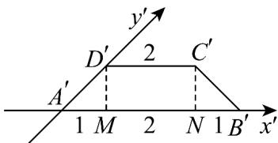
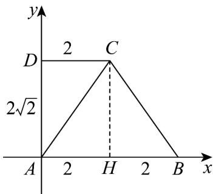

> [!faq]- 《专题21 立体几何初步及复数精选压轴60题12类考点专练（高效培优期中专项训练）数学人教A版高一必修第二册_57404446》官方解析
>
> > [!success]- **【答案】** BC
>
> > [!note]- **【分析】**
> > A选项，作出辅助线，得到各边长，结合 $\angle DAM = 45^{\circ}$ ，求出 $A^{\prime}D^{\prime} = \sqrt{2}$ ；B选项，由斜二测法
> >
> > 可知 $AB = A'B' = 4$ ；C选项，作出原图形，求出各边，由梯形面积公式得到C正确；D选项，在C基础上，
> >
> > 求出各边长，得到周长。
>
> > [!note]- **【解析】**
> > 对于 A 选项，过点 $C'$ ， $D'$ 作 $C'N$ ， $D'M$ 垂直于 $x'$ 轴于点 N，M
> >
> > 因为等腰梯形 $A^{\prime}B^{\prime}C^{\prime}D^{\prime}$ 中 $A^{\prime}B^{\prime}=4$ ， $C^{\prime}D^{\prime}=2$ ，
> >
> > 所以 $MN = 2$ ， $A^{\prime}M = B^{\prime}N = 1$
> >
> > 又 $\angle D^{\prime}A^{\prime}M = 45^{\circ}$ ，所以 $A^{\prime}D^{\prime} = \sqrt{2}$ ，故A错误；
> >
> > 
> >
> > 对于 B 选项，由斜二测法可知 $AB = A'B' = 4$ ，故 B 正确；
> >
> > 对于 C 选项，作出原图形，可知 $AD = 2A'D' = 2\sqrt{2}$ ， $AB = 4$ ， $CD = 2$ ， $AD \perp AB$ ，
> >
> > 故四边形 ABCD 的面积为 $\frac{(CD+AB)\cdot AD}{2}=6\sqrt{2}$ ，故 C 正确；
> >
> > 
> >
> > 对于 D 选项，过点 C 作 $CH \perp AB$ 于点 H ，
> >
> > 则 $AH = CD = 2$ ， $BH = 4 - 2 = 2$ ， $CH = AD = 2\sqrt{2}$
> >
> > 由勾股定理得 $BC = \sqrt{BH^2 + CH^2} = 2\sqrt{3}$
> >
> > 四边形 $ABCD$ 的周长为 $AB + CD + AD + BC = 4 + 2 + 2\sqrt{2} + 2\sqrt{3} = 6 + 2\sqrt{2} + 2\sqrt{3}$ ，故D错误.
> >
> > 4．一水平放置的平面四边形 OABC 的直观图 $O'A'B'C'$ 如图所示，其中 $O'A'=O'C'=2$ ， $O'C'\perp x'$ 轴， $A^{\prime}B^{\prime}\perp x^{\prime}$ 轴， $B^{\prime}C^{\prime}//y^{\prime}$ 轴，则四边形 OABC 的面积为（）
> >
> > 【答案】
> >
> > 
> >
> > A. $\frac{3\sqrt{2}}{2}$ B.6 C. $\frac{3}{2}$ D. $12\sqrt{2}$
> >
> > 【答案】D
> >
> > 【分析】结合图形可得 $A'B' = 4$ ，求出四边形 $O'A'B'C'$ 面积后可得四边形 OABC 的面积。
> > 【详解】设 $y'$ 轴与 $A'B'$ 交点为 D，
> > 因为 $O'C' \perp x'$ 轴， $A'B' \perp x'$ 轴，
> > 所以 $O'C' // A'B'$
> >
> > 
> >
> > 因为 $B^{\prime}C^{\prime}//y^{\prime}$ 轴，
> >
> > 所以四边形 $B^{\prime}C^{\prime}O^{\prime}D$ 为平行四边形，
> >
> > 故 $DB' = O'C' = 2$
> >
> > 又 $\angle x^{\prime}O^{\prime}y^{\prime} = 45^{\circ}$ ， $A^{\prime}B^{\prime}\perp x^{\prime}$ 轴，
> >
> > 得 $DA' = O'A' = 2$ ，
> >
> > 故 $A^{\prime}B^{\prime}=4$
> >
> > 所以四边形 $O^{\prime}A^{\prime}B^{\prime}C^{\prime}$ 面积为 $\frac{1}{2}(2+4)\times2=6$ ,
> >
> > 因为四边形 $O'A'B'C'$ 面积是四边形 $OABC$ 的面积的 $\frac{\sqrt{2}}{4}$
> >
> > 所以四边形 $OABC$ 的面积为 $12 \sqrt{2}$
