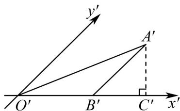

> [!faq]- 《专题21 立体几何初步及复数精选压轴60题12类考点专练（高效培优期中专项训练）数学人教A版高一必修第二册_57404446》官方解析
>
> > [!success]- **【答案】**  A. $16\sqrt{2}$ B. $\sqrt{2}$ C. $2\sqrt{2}$ D. 1
>
> > [!note]- **【解析】**
> > 因为 $A^{\prime}B^{\prime}//O^{\prime}y^{\prime}$ ， $O^{\prime}B^{\prime}=4$ 所以原 Rt△ABO 中， $AB\perp OB$ ，且 x 轴方向长度不变，
> >
> > 因此 $OB = O'B' = 4$
> >
> > 已知 Rt△ABO 面积为 16，由直角三角形面积公式： $\frac{1}{2}OB\cdot AB=16\Rightarrow\frac{1}{2}\times4\cdot AB=16\Rightarrow AB=8$ 在斜二测画法中，y轴方向长度变为原来的 $\frac{1}{2}$ ，因此 $A^{\prime}B^{\prime}=\frac{1}{2}AB=\frac{1}{2}\times8=4$
> >
> > 因为 $y'$ 轴与 $x'$ 轴夹角为 $45^{\circ}$ ， $A'C'\perp x'$ 轴，
> >
> > 所以在直角三角形 $\mathrm{Rt}\triangle A'B'C'$ 中： $A^{\prime}C^{\prime} = A^{\prime}B^{\prime}\sin 45^{\circ} = 4\times \frac{\sqrt{2}}{2} = 2\sqrt{2}$
> >
> > 因此 $A^{\prime}C^{\prime}$ 的长为 $2\sqrt{2}$ .
