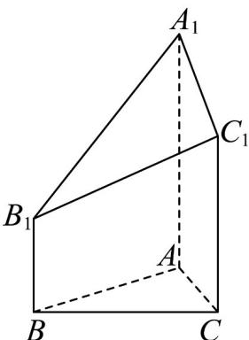

<!-- question-source:start -->
13．如图，在几何体 $ABC - A_{1}B_{1}C_{1}$ 中，侧棱 $AA_{1},BB_{1},CC_{1}$ 均垂直于底面 $ABC$ ，已知

$AB = BC = AC = CC_{1} = 4$ ， $BB_{1} = 2,AA_{1} = 6$ ，则该几何体的体积为

<!-- question-source:end -->

![[高中/课堂同步/题库/人教A版高中数学同步讲义(2026)/02_必修第二册/期中专项训练+期中模拟卷/专题21 立体几何初步及复数精选压轴60题12类考点专练（高效培优期中专项训练）数学人教A版高一必修第二册_57404446/题型三_柱_圆锥_圆台的表面积和体积/questions/answers/Q00077465A1.md]]
