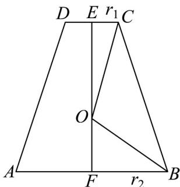

> [!faq]- 《专题21 立体几何初步及复数精选压轴60题12类考点专练（高效培优期中专项训练）数学人教A版高一必修第二册_57404446》官方解析
>
> > [!success]- **【答案】** A. $2\sqrt{2}$ B. $\frac{\sqrt{21}}{3}$ C. $\frac{2\sqrt{21}}{3}$ D. $\sqrt{21}$
>
> > [!note]- **【分析】**
> > 先利用圆台侧面积公式得到母线长和圆台的高，再由勾股定理求出球的半径.
>
> > [!note]- **【解析】**
> > 设圆台母线长为 $l$ ，上、下底面半径分别为 $r_1 = 1$ 和 $r_2 = 3$
> >
> > 则圆台的侧面积为 $S_{\text{侧}} = \pi (r_1 + r_2)l = \pi \times (1 + 3)l = 16\pi$ ，即 $l = 4$ ，
> >
> > 所以圆台的高为 $h = \sqrt{l^2 - (r_2 - r_1)^2} = \sqrt{16 - 4} = 2\sqrt{3}$
> >
> > 设球 O 的半径为 R ，圆台轴截面为等腰梯形 ABCD ，且 AB = 6, CD = 2 ，如图，
> >
> > 过 O 作 AB 的垂线，与 AB 交于点 F，与 CD 交于点 E
> >
> > 设 $OF = x$ ，由 $r_1^2 + h^2 = 13 > r_2^2$ ，则球心 $O$ 在圆台内部，
> >
> > 所以 $\left\{ \begin{array}{l} R^{2} = 3^{2} + x^{2} \\ R^{2} = 1^{2} + (2\sqrt{3} - x)^{2} \end{array} \right.$ ，解得 $x = \frac{\sqrt{3}}{3}, R = \frac{2\sqrt{21}}{3}$ .
> >
> > 
